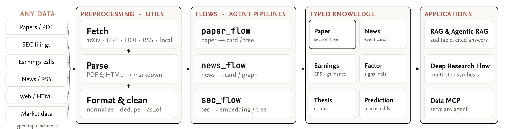
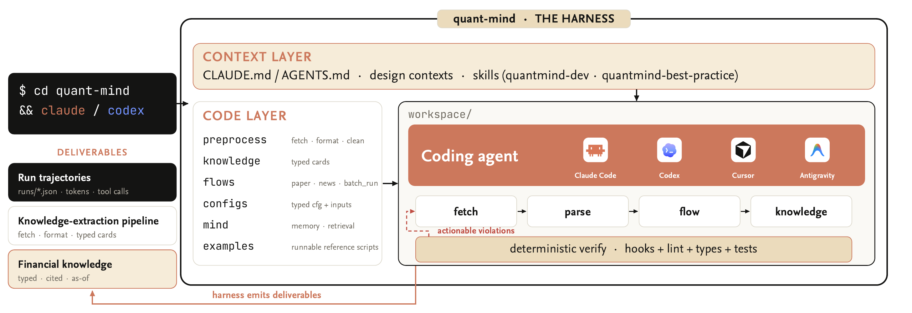
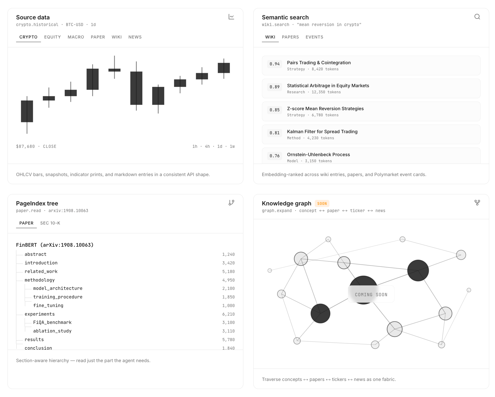

<p align="center">
  
</p>

<p align="center">
  
</p>

<p align="center">
  <b>Transform Financial Knowledge into Actionable Intelligence</b>
</p>
<p align="center">
  <a href="https://github.com/LLMQuant/quant-mind/blob/main/LICENSE">
    
  </a>
  <a href="https://python.org">
    
  </a>
</p>
<p align="center">
  <a href="#-knowledge-engineering">Knowledge Engineering</a> •
  <a href="#-the-vision">The Vision</a> •
  <a href="#-quick-start">Quick Start</a> •
  <a href="#-evaluation-in-design">Evaluation</a> •
  <a href="#-in-production-llmquant-data">In Production</a> •
  <a href="#%EF%B8%8F-roadmap">Roadmap</a> •
  <a href="#-contributing">Contributing</a>
</p>


QuantMind is an information processor for quantitative finance: it refines raw financial information — papers, news, filings — into structured financial knowledge that downstream retrieval and reasoning can trust. Every piece of knowledge is typed, keeps its citation, and knows its timestamp, so it persists and time-queries standalone.

The people who build these refinement flows are increasingly agents — coding agents, with humans behind them. So the repository is designed agent-oriented: you open the checkout, describe the pipeline you want, and an agent builds it here against the repo's contracts, skills, and deterministic verification. It is also a perfectly good importable Python library.

### 📰 News
| 🗞️ News        | 📝 Description                                                                 |
|----------------|-------------------------------------------------------------------------------|
| 🛠️ 2026-07 | Rebuilding the repo **agent-native** — contexts, skills, hooks — so a coding agent can do QuantMind-quality work inside the checkout. |
| 🎉 Accepted at NeurIPS 2025 Workshop | Our paper **[Quant-Mind](#)** has been accepted to the **[NeurIPS 2025 GenAI in Finance Workshop](https://sites.google.com/view/neurips-25-gen-ai-in-finance/home)** !🚀 |
| 📢 First Release on GitHub  | **Quant-Mind** is now live on GitHub — please check it out and join us! 🤗 |


### 🧩 Knowledge Engineering

**Any source → typed knowledge.**

<p align="center"></p>

*The target surface — shipping today: `PaperFlow` · `collect_news`; see Roadmap.*

- **Deterministic preprocess** — `fetch` / parse / `format` + `clean` produce source-faithful values with no model in the loop, so provenance is exact and replayable.
- **Config-driven operations** — `PaperFlow(cfg).build(input)` binds an immutable build config once and applies it per input; `collect_news` collects a replayable source window; `batch_run` fans any operation across a list of inputs. You never write `asyncio.gather` boilerplate.
- **Typed knowledge shapes** — a `Paper` structure tree for whole documents, and flat cards for `News` / `Earnings` / `Factor` / `Thesis`. Every artifact is self-contained: it carries its own text, an `as_of` timestamp, and a light source ref, so it persists and time-queries standalone.
- **Retrieval over that knowledge** — `rag/` (chunking + BM25 / similarity), `library/` (local persistence + meaning-based search), and `mind/` (agentic, reasoning-based retrieval). Together they serve RAG and Agentic RAG, deep research, and data-MCP serving.

This is the substance shipped as the NeurIPS 2025 GenAI-in-Finance workshop paper (**arXiv:2509.21507**). The always-current statement lives in [`contexts/design/positioning.md`](contexts/design/positioning.md).

### 🧠 The Vision

**Harness engineering — any agent → domain specialist.**

<p align="center"></p>

> **Don't import it. Open it.**

The repository itself is the product surface — we call this **harness engineering**. Its `AGENTS.md` / `CLAUDE.md` contracts, progressive-disclosure `contexts/`, portable skills, and Claude + Codex hooks, all gated by a deterministic verify, upgrade a general coding agent into one that reliably does QuantMind-quality work. The bet: **a weak model in a good harness beats a strong model running bare.**

- **Repo-level contracts** — `AGENTS.md` / `CLAUDE.md` state the always-on rules once, in one source, for every agent that opens the repo.
- **Progressive-disclosure `contexts/`** — agent-facing pages with a Quick Summary / Contents preview, so an agent loads only the one page a task needs.
- **Portable skills** — `quantmind-dev` ships today (contributor setup / commit / PR / component workflow), mirrored for Claude and Codex.
- **Claude + Codex hooks** — shared hook scripts give both agents identical hard guarantees without maintaining two copies of a rule.
- **Deterministic verify** — `scripts/verify.sh` runs lint + types + import boundaries + tests, fast-failing in a fixed order; CI runs the exact same script.

See [`contexts/dev/harness-engineering.md`](contexts/dev/harness-engineering.md) for the enforcement mechanics.


### 🚀 Quick Start

#### The agent path (recommended)

QuantMind is meant to be opened, not imported. Point a coding agent at the checkout and describe the pipeline you want:

```bash
git clone https://github.com/LLMQuant/quant-mind.git
cd quant-mind && claude      # or: codex
```

Then, in the agent session:

> "Build me a source-first paper artifact for arXiv 1706.03762, then persist it and search the summary."

The agent reads the repo's contracts (`AGENTS.md`), loads the relevant `contexts/` pages, writes the pipeline, and runs `scripts/verify.sh` before it hands the change back.

#### The library path

QuantMind is still a normal Python package. We use [uv](https://github.com/astral-sh/uv) for package management.

```bash
uv venv && source .venv/bin/activate
uv pip install -e .
```

`PaperFlow` refines one arXiv PDF into a self-contained paper artifact. The cfg **type** selects the knowledge shape (`PaperStructureCfg` → `PaperStructureTree`, `PaperSemanticCfg` → `PaperSemanticResult`). Bind a `PaperStructureCfg` to build a source-native **structure tree** — a hierarchy of page-cited nodes:

```python
import asyncio

from quantmind.configs import PaperStructureCfg
from quantmind.configs.paper import ArxivIdentifier
from quantmind.flows import PaperFlow


async def main() -> None:
    flow = PaperFlow(PaperStructureCfg(model="gpt-5.6-luna"))
    tree = await flow.build(ArxivIdentifier(id="1706.03762v7"))
    print(tree.id, len(tree.nodes))


asyncio.run(main())
```

Prefer the **semantic** shape — a page-aware chunk set plus one cited global summary you can embed and retrieve over? Bind a `PaperSemanticCfg` instead — same class, different cfg:

```python
import asyncio

from quantmind.configs import PaperSemanticCfg
from quantmind.configs.paper import ArxivIdentifier
from quantmind.flows import PaperFlow


async def main() -> None:
    flow = PaperFlow(PaperSemanticCfg(model="gpt-5.6-luna", chunk_size=512))
    result = await flow.build(ArxivIdentifier(id="1706.03762v7"))
    print(result.global_summary.summary)
    print(result.source_revision.id, result.chunk_set.id)


asyncio.run(main())
```

#### Fan out a batch with `batch_run`

```python
import asyncio
from datetime import datetime, timedelta, timezone

from quantmind.configs import NewsCollectionCfg, NewsWindow
from quantmind.flows import batch_run, collect_news


async def main() -> None:
    end = datetime.now(timezone.utc)
    windows = [
        NewsWindow(
            source="pr-newswire",
            start=end - timedelta(days=day + 1),
            end=end - timedelta(days=day),
        )
        for day in range(3)
    ]
    result = await batch_run(
        collect_news,
        windows,
        cfg=NewsCollectionCfg(retain_raw_html=False),
        concurrency=3,
        on_error="skip",
        on_progress=lambda done, total: print(f"{done}/{total}"),
    )
    print(f"ok={result.success_count} failed={result.failure_count}")


asyncio.run(main())
```

#### Resolve free-form intent with `magic`

```python
import asyncio

from quantmind.flows import collect_news
from quantmind.magic import resolve_magic_input


async def main() -> None:
    inp, cfg = await resolve_magic_input(
        "Collect the last day of PR Newswire company news.",
        target_flow=collect_news,
    )
    batch = await collect_news(inp, cfg=cfg)
    print(f"documents={batch.success_count} complete={batch.complete}")


asyncio.run(main())
```

More examples live under [`examples/`](examples/); design contracts live under [`contexts/design/`](contexts/design/).

### 🔬 Evaluation (In Design)

> [!NOTE]
> Evaluation is in the **design phase** — no results are claimed yet. Our framing follows Anthropic's [Demystifying evals for AI agents](https://www.anthropic.com/engineering/demystifying-evals-for-ai-agents).

**quantmind-bench** measures the harness bet directly. Following the SWE-bench model, it runs **paired trials on the same model and the same task set**: once against a bare checkout, once against the QuantMind repo mounted with its contracts, contexts, skills, and hooks. The reported deltas are **cost-to-green, pass@1, pass^k across seeds, and wall-clock** — how much a good harness moves a fixed model. Run instrumentation (tokens / cost / duration / a verify oracle) already ships; the protocol that consumes it is being designed, and no numbers are published.

A separate **llmquant-data-bench** will score knowledge quality (correctness, citation precision/recall, point-in-time correctness); it is likewise in design.

### 🏭 In Production: LLMQuant Data

LLMQuant Data is QuantMind in production. The hosted data platform runs extraction pipelines powered by QuantMind: QuantMind is the open engine, LLMQuant Data is the operated product on top of it. The dependency direction is one-way — `llmquant-data` imports `quantmind`, never the reverse.

<p align="center"></p>


### 🗺️ Roadmap

Directions we are actively pushing on (not yet shipped):

- **More agent-native** — a `quantmind-best-practice` skill alongside the shipped `quantmind-dev`, and an agent-first contributing path.
- **Broader coverage** — a SEC / filings collection flow and a prediction-market knowledge type, beyond today's papers and news.
- **Evaluation** — land the `quantmind-bench` protocol and publish its first paired runs.

Development is moving fast. If you need a source, a knowledge type, or a flow we do not have yet, [open an issue](https://github.com/LLMQuant/quant-mind/issues) — we welcome the request.


### 🤝 Contributing

Prefer manual steps? See [`.claude/skills/quantmind-dev/references/setup.md`](.claude/skills/quantmind-dev/references/setup.md).

The fastest path is to let a coding agent drive. Inside the checkout, tell Claude Code:

```text
/quantmind-dev set me up as a contributor
/quantmind-dev file an issue: <what you need>
/quantmind-dev I want to contribute <your change>
```

Codex users say the same thing in words — the skill is mirrored under `.agents/skills/quantmind-dev/`, so both agents follow one workflow: contributor setup, filing an issue, and developing a change with tests, verification, commit, and PR.

> [!IMPORTANT]
> **For Contributors**: [CONTRIBUTING.md](CONTRIBUTING.md) covers the same setup for humans — environment, pre-commit hooks, coding standards, and testing. `scripts/verify.sh` is the single deterministic check; CI runs the exact same script.

We welcome contributions of all forms, from bug reports to feature development. Open an [issue](https://github.com/LLMQuant/quant-mind/issues) to discuss significant changes before you start, and make sure `bash scripts/verify.sh` is green before you open a PR.

### License

QuantMind is released under the MIT License—see `LICENSE` for details.

### ❤️ Acknowledgements

- **arXiv** for providing open access to a world of research.
- The **open-source community** for the tools and libraries that make this project possible.
</content>
</invoke>
