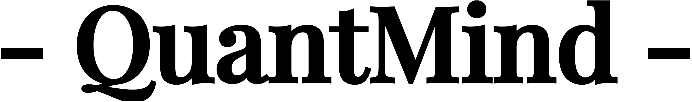
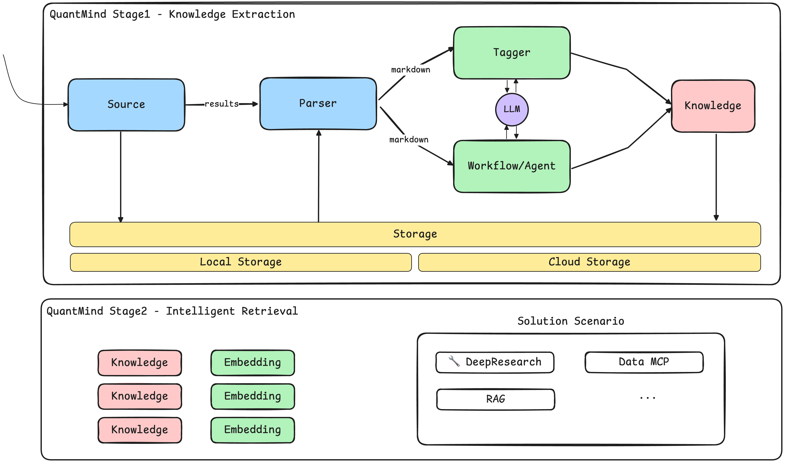

<p align="center">
  
</p>

<p align="center">
  
</p>

<p align="center">
  <b>Transform Financial Knowledge into Actionable Intelligence</b>
</p>
<p align="center">
  <a href="https://github.com/LLMQuant/quant-mind/blob/main/LICENSE">
    
  </a>
  <a href="https://python.org">
    
  </a>
</p>
<p align="center">
  <a href="#-why-quantmind">Why QuantMind</a> •
  <a href="#system-architecture">Architecture</a> •
  <a href="#-quick-start">Quick Start</a> •
  <a href="#-usage-examples">Usage</a> •
  <a href="#%EF%B8%8F-roadmap">Roadmap</a> •
  <a href="#the-vision-an-intelligent-research-agent">Vision</a> •
  <a href="#-contributing">Contributing</a>
</p>

---

**QuantMind** is an intelligent knowledge extraction and retrieval framework for quantitative finance. It transforms unstructured financial content—papers, news, blogs, reports—into a queryable knowledge base, enabling AI-powered research at scale.

### 📰 News
| 🗞️ News        | 📝 Description                                                                 |
|----------------|-------------------------------------------------------------------------------|
| 🎉 Accepted at NeurIPS 2025 Workshop | Our paper **[Quant-Mind](#)** has been accepted to the **[NeurIPS 2025 GenAI in Finance Workshop](https://sites.google.com/view/neurips-25-gen-ai-in-finance/home)** !🚀 |
| 📢 First Release on GitHub  | **Quant-Mind** is now live on GitHub — please check it out and join us! 🤗 |

### 🧐 Overview

QuantMind is a next-generation AI platform that ingests, processes, and structures **every** new piece of quantitative-finance research, including papers, news, blogs, and SEC filings into a **semantic knowledge graph**. Institutional investors, hedge funds, and research teams can now explore the frontier of factor strategies, risk models, and market insights in **seconds**, unlocking alpha that would otherwise remain buried.

### ✨ Why QuantMind?

The financial research landscape is overwhelming. Every day, hundreds of papers, articles, and reports are published.

#### 🌐 The Opportunity

- **Information Overload**: 500 new research papers & reports published daily. Manual review takes weeks—costly, error-prone, and non-scalable
- **Massive Market**: Financial data & analytics market ≫ expected to grow to US$961.89 billion by 2032, with a compound annual growth rate of 13.5%. Tens of thousands of quant teams & asset managers hungry for speed
- **High ROI**: 1% improvement in research efficiency can translate to millions saved or earned in trading performance

---

#### 💡 **QuantMind** solves this by

- 🔍 **Extracting** structured knowledge from any source (PDFs, web pages, APIs)
- 🧠 **Understanding** content with domain-specific LLMs fine-tuned for finance
- 💾 **Storing** information in a semantic knowledge graph
- 🚀 **Retrieving** insights through natural language queries

---

### System Architecture



QuantMind is built on a decoupled, two-stage architecture. This design separates the concerns of data ingestion from intelligent retrieval, ensuring both robustness and flexibility.

#### **Stage 1: Knowledge Extraction**

This layer is responsible for collecting, parsing, and structuring raw information into standardized knowledge units.

```text
Source APIs (arXiv, News, Blogs) → Intelligent Parser → Workflow/Agent → Structured Knowledge Base
```

- **Source**: Connects to various sources (academic APIs, news feeds, financial blogs, perplexity search source) to pull content
- **Parser**: Extracts text, tables, and figures from PDFs, HTML, and other formats
- **Tagger**: Automatically categorizes content into research areas and topics
- **Workflow/Agent**: Orchestrates the extraction pipeline with quality control and deduplication

#### **Stage 2: Intelligent Retrieval**

This layer transforms structured knowledge into actionable insights through various retrieval mechanisms.

```
Knowledge Base → Embeddings → Solution Scenarios (DeepResearch, RAG, Data MCP, ...)
```

- **Embedding Generation**: Converts knowledge units into high-dimensional vectors for semantic search

- Solution Scenarios: Multiple retrieval patterns including:

  - **DeepResearch**: Complex multi-hop reasoning across documents
  - **RAG**: Retrieval-augmented generation for Q&A
  - **Data MCP**: Structured data access protocols
  - Custom retrieval patterns based on use case

---

### 🚀 Quick Start

We use [uv](https://github.com/astral-sh/uv) for fast and reliable Python package management.

**Prerequisites:**

- Python 3.8+
- Git

**Installation:**

1. **Install uv (if not already installed):**

   ```bash
   # On macOS and Linux
   curl -LsSf https://astral.sh/uv/install.sh | sh

   # On Windows
   powershell -c "irm https://astral.sh/uv/install.ps1 | iex"

   # Or using pip
   pip install uv
   ```

2. **Clone the repository:**

   ```bash
   git clone https://github.com/LLMQuant/quant-mind.git
   cd quant-mind
   ```

3. **Create and activate virtual environment:**

   ```bash
   # Create a virtual environment
   uv venv

   # Activate it
   # On macOS/Linux:
   source .venv/bin/activate

   # On Windows:
   .venv\Scripts\activate
   ```

4. **Install dependencies:**

   ```bash
   uv pip install -e .
   ```

### 📚 Usage Examples

Component-specific guides and architecture notes live under [`docs/`](docs/).

#### Build an exact paper source, chunks, and cited summary

```python
import asyncio

from quantmind.configs import PaperSemanticCfg
from quantmind.configs.paper import ArxivIdentifier
from quantmind.flows import PaperFlow


async def main() -> None:
    result = await PaperFlow(
        PaperSemanticCfg(model="gpt-5.6-luna"),
    ).build(ArxivIdentifier(id="1706.03762v7"))
    print(result.global_summary.summary)
    print(result.source_revision.id, result.chunk_set.id)


asyncio.run(main())
```

`PaperFlow` binds an immutable `PaperSemanticCfg` once; the cfg **type** selects
the shape (`PaperStructureCfg` → `PaperStructureTree`, `PaperSemanticCfg` →
`PaperSemanticResult`).

#### Fan out a batch with `batch_run`

```python
import asyncio
from datetime import datetime, timedelta, timezone

from quantmind.configs import NewsCollectionCfg, NewsWindow
from quantmind.flows import batch_run, collect_news


async def main() -> None:
    end = datetime.now(timezone.utc)
    windows = [
        NewsWindow(
            source="pr-newswire",
            start=end - timedelta(days=day + 1),
            end=end - timedelta(days=day),
        )
        for day in range(3)
    ]
    result = await batch_run(
        collect_news,
        windows,
        cfg=NewsCollectionCfg(retain_raw_html=False),
        concurrency=3,
        on_error="skip",
        on_progress=lambda done, total: print(f"{done}/{total}"),
    )
    print(f"ok={result.success_count} failed={result.failure_count}")


asyncio.run(main())
```

#### Resolve free-form intent with `magic`

```python
import asyncio

from quantmind.flows import collect_news
from quantmind.magic import resolve_magic_input


async def main() -> None:
    inp, cfg = await resolve_magic_input(
        "Collect the last day of PR Newswire company news.",
        target_flow=collect_news,
    )
    batch = await collect_news(inp, cfg=cfg)
    print(f"documents={batch.success_count} complete={batch.complete}")


asyncio.run(main())
```

Paper Flow V1 is source-first: code preserves the exact PDF revision and
page-aware chunks before accepting a bounded, cited model summary. See the
[complete persist/reopen/search example](examples/flows/paper.py) and
[design contract](contexts/design/flow/paper.md).

---

### 🗺️ Roadmap

- [x] Better `flow` design for user-friendly usage
- [x] First production level example (Quant Paper Agent)
- [ ] Migrate Agent layer to OpenAI Agents SDK
- [x] Standardize knowledge format with `knowledge/` (Pydantic-based)
- [ ] Additional content sources (financial news, blogs, reports)
- [ ] Cross-step working memory (`mind/memory`) for batch document processing

---

### The Vision: An Intelligent Research Framework

> [!IMPORTANT]
> **This section describes our long-term vision, not current capabilities.** While QuantMind today provides a solid knowledge extraction framework, the features described below represent our aspirational goals for future development.

QuantMind is designed with a larger vision: to become a comprehensive intelligence layer for all financial knowledge. We're building toward a system that understands the interconnections between academic research, market news, analyst reports, and social sentiment—creating a unified knowledge base that powers better financial decisions.

The foundation we're building today—starting with papers—will expand to encompass the entire financial information ecosystem.

> [!NOTE]
> The current source-first paper path produces independently versioned source,
> chunk-set, and cited-summary artifacts. Future agent memory and cross-document
> reasoning can build on `LocalKnowledgeLibrary.search()` without changing
> those canonical artifacts.

This future state represents our commitment to moving beyond simple data aggregation and toward genuine machine intelligence in the financial domain.

------

### 🤝 Contributing

We welcome contributions of all forms, from bug reports to feature development.

> [!IMPORTANT]
> **For Contributors**: Please read [CONTRIBUTING.md](CONTRIBUTING.md) for essential development setup including pre-commit hooks, coding standards, and testing requirements.

**Quick Start for Contributors:**

1. **Fork** the repository
2. **Setup development environment**:

   ```bash
   uv venv && source .venv/bin/activate
   uv pip install -e .
   ./scripts/pre-commit-setup.sh
   ```

3. **Create feature branch** (`git checkout -b feat/my-feature`)
4. **Follow conventional commits** (`feat: add new feature`)
5. **Submit PR** with our template

**Before Contributing:**

- Open an [issue](https://github.com/LLMQuant/quant-mind/issues) to discuss significant changes
- Use our issue templates for bug reports and feature requests
- Ensure all pre-commit hooks pass before submitting PR

### License

QuantMind is released under the MIT License—see `LICENSE` for details.

### ❤️ Acknowledgements

- **arXiv** for providing open access to a world of research.
- The **open-source community** for the tools and libraries that make this project possible.
