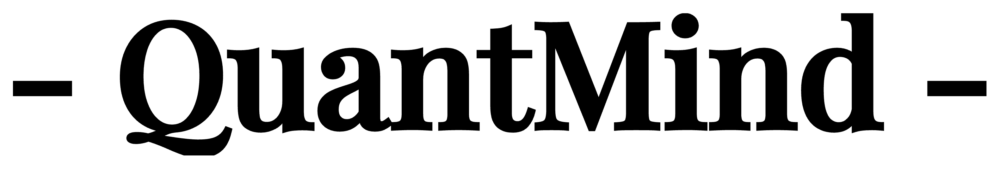

<p align="center">
  
</p>

<p align="center">
  
</p>

<p align="center">
  <b>Transform Financial Knowledge into Actionable Intelligence</b>
</p>
<p align="center">
  <a href="https://github.com/LLMQuant/quant-mind/blob/main/LICENSE">
    
  </a>
  <a href="https://python.org">
    
  </a>
</p>
<p align="center">
  <a href="#-why-quantmind">Why QuantMind</a> •
  <a href="#system-architecture">Architecture</a> •
  <a href="#-quick-start">Quick Start</a> •
  <a href="#-usage-examples">Usage</a> •
  <a href="#%EF%B8%8F-roadmap">Roadmap</a> •
  <a href="#the-vision-an-intelligent-research-agent">Vision</a> •
  <a href="#-contributing">Contributing</a>
</p>

---

**QuantMind** is an intelligent knowledge extraction and retrieval framework for quantitative finance. It transforms unstructured financial content—papers, news, blogs, reports—into a queryable knowledge base, enabling AI-powered research at scale.
### 🧐 Overview
QuantMind is a next-generation AI platform that ingests, processes, and structures **every** new piece of quantitative-finance research, including papers, news, blogs, and SEC filings into a **semantic knowledge graph**. Institutional investors, hedge funds, and research teams can now explore the frontier of factor strategies, risk models, and market insights in **seconds**, unlocking alpha that would otherwise remain buried.

### ✨ Why QuantMind?

The financial research landscape is overwhelming. Every day, hundreds of papers, articles, and reports are published. **QuantMind** solves this by:
The financial research landscape is overwhelming. Every day, hundreds of papers, articles, and reports are published.


#### 🌐 The Opportunity
- **Information Overload**: 500 new research papers & reports published daily. Manual review takes weeks—costly, error-prone, and non-scalable  
- **Massive Market**: Financial data & analytics market ≫ expected to grow to US$961.89 billion by 2032, with a compound annual growth rate of 13.5%. Tens of thousands of quant teams & asset managers hungry for speed  
- **High ROI**: 1% improvement in research efficiency can translate to millions saved or earned in trading performance  

---

#### 💡 **QuantMind** solves this by:
- 🔍 **Extracting** structured knowledge from any source (PDFs, web pages, APIs)
- 🧠 **Understanding** content with domain-specific LLMs fine-tuned for finance
- 💾 **Storing** information in a semantic knowledge graph
- 🚀 **Retrieving** insights through natural language queries

---

### System Architecture


QuantMind is built on a decoupled, two-stage architecture. This design separates the concerns of data ingestion from intelligent retrieval, ensuring both robustness and flexibility.

#### **Stage 1: Knowledge Extraction**

This layer is responsible for collecting, parsing, and structuring raw information into standardized knowledge units.

```text
Source APIs (arXiv, News, Blogs) → Intelligent Parser → Workflow/Agent → Structured Knowledge Base
```

- **Source**: Connects to various sources (academic APIs, news feeds, financial blogs, perplexity search source) to pull content
- **Parser**: Extracts text, tables, and figures from PDFs, HTML, and other formats
- **Tagger**: Automatically categorizes content into research areas and topics
- **Workflow/Agent**: Orchestrates the extraction pipeline with quality control and deduplication

#### **Stage 2: Intelligent Retrieval**

This layer transforms structured knowledge into actionable insights through various retrieval mechanisms.

```
Knowledge Base → Embeddings → Solution Scenarios (DeepResearch, RAG, Data MCP, ...)
```

- **Embedding Generation**: Converts knowledge units into high-dimensional vectors for semantic search

- Solution Scenarios: Multiple retrieval patterns including:

  - **DeepResearch**: Complex multi-hop reasoning across documents
  - **RAG**: Retrieval-augmented generation for Q&A
  - **Data MCP**: Structured data access protocols
  - Custom retrieval patterns based on use case

---

### 🚀 Quick Start

We use [uv](https://github.com/astral-sh/uv) for fast and reliable Python package management.

**Prerequisites:**

- Python 3.8+
- Git

**Installation:**

1. **Install uv (if not already installed):**

   ```bash
   # On macOS and Linux
   curl -LsSf https://astral.sh/uv/install.sh | sh

   # On Windows
   powershell -c "irm https://astral.sh/uv/install.ps1 | iex"

   # Or using pip
   pip install uv
   ```

2. **Clone the repository:**

   ```bash
   git clone https://github.com/LLMQuant/quant-mind.git
   cd quant-mind
   ```

3. **Create and activate virtual environment:**

   ```bash
   # Create a virtual environment
   uv venv

   # Activate it
   # On macOS/Linux:
   source .venv/bin/activate

   # On Windows:
   .venv\Scripts\activate
   ```

4. **Install dependencies:**

   ```bash
   uv pip install -e .
   ```

### 📚 Usage Examples

#### Basic Paper Search and Processing

```python
from quantmind.sources import ArxivSource
from quantmind.storage import LocalStorage
from quantmind.config import ArxivSourceConfig, LocalStorageConfig

# Configure source and storage
arxiv_config = ArxivSourceConfig(max_results=10)
storage_config = LocalStorageConfig(storage_dir="./data")

# Initialize components
source = ArxivSource(config=arxiv_config)
storage = LocalStorage(config=storage_config)

# Search for papers
papers = source.search("machine learning finance")

# Store papers locally
storage.process_knowledges(papers)

# Display results
for paper in papers:
    print(f"Title: {paper.title}")
    print(f"Authors: {', '.join(paper.authors)}")
    print(f"Categories: {', '.join(paper.categories)}")
```

#### Quant Paper Agent Example

> [!Note]
>
> Will come soon.

---

### 🗺️ Roadmap

- [ ] Better `flow` design for user-friendly usage
- [ ] First production level example (Quant Paper Agent)
- [ ] `tool` integration for more advanced usage
- [ ] Additional content sources (financial news, blogs, reports)
- [ ] Standardize the `knowledge` format (data standardization)

---

### The Vision: An Intelligent Research Framework

> [!IMPORTANT]
> **This section describes our long-term vision, not current capabilities.** While QuantMind today provides a solid knowledge extraction framework, the features described below represent our aspirational goals for future development.

QuantMind is designed with a larger vision: to become a comprehensive intelligence layer for all financial knowledge. We're building toward a system that understands the interconnections between academic research, market news, analyst reports, and social sentiment—creating a unified knowledge base that powers better financial decisions.

The foundation we're building today—starting with papers—will expand to encompass the entire financial information ecosystem.

> [!NOTE]
> **Future Conceptual Example:**
>
> ```python
> # The future we are building towards
> from quantmind import KnowledgeBase, MemoryBank
> from quantmind.agents import PaperReader, NewsMonitor
> from quantmind.brain import understand, memorize, recall
>
> # Initialize the knowledge base
> kb = KnowledgeBase()
> kb.ingest(source="arxiv", topic="portfolio optimization")
>
> # Query for high-level insights
> insights = kb.query("latest trends in risk parity strategies")
> ```

This future state represents our commitment to moving beyond simple data aggregation and toward genuine machine intelligence in the financial domain.

------

### 🤝 Contributing

We welcome contributions of all forms, from bug reports to feature development. If you're interested in helping build the future of financial research, please review our contribution guidelines. For more details, please refer to [CONTRIBUTING.md](CONTRIBUTING.md).

1. **Fork** the repository.
2. **Create a new branch** (`git checkout -b feature/my-new-feature`).
3. **Commit your changes** (`git commit -am 'Add some feature'`).
4. **Push to the branch** (`git push origin feature/my-new-feature`).
5. **Create a new Pull Request**.

Please open an issue in the [GitHub Issues](https://github.com/LLMQuant/quant-mind/issues) tab to discuss any significant changes beforehand.

### License

This project is licensed under the MIT License - see the [LICENSE](https://claude.ai/chat/LICENSE) file for details.

### ❤️ Acknowledgements

- **arXiv** for providing open access to a world of research.
- The **open-source community** for the tools and libraries that make this project possible.
