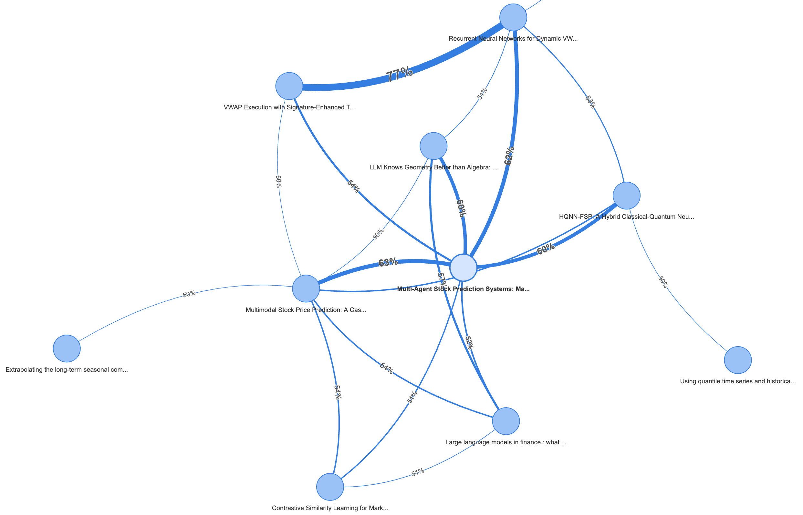

# Quant Scholar



## AutoScholar Setup Guide

### Installing UV

> [!Note]
> UV is a new Python packaging tool designed to be fast and reliable. If you don't have UV installed, you need to install it first.

```bash
# Install UV using pip
pip install uv

# Or using curl (recommended for Unix/macOS)
curl -LsSf https://astral.sh/uv/install.sh | sh

# Or for Windows PowerShell
irm https://astral.sh/uv/install.ps1 | iex
```

### Setting Up a Project with UV

> [!Tip]
> UV can create virtual environments and install dependencies in one step, which is much faster than traditional methods.

```bash
# Create a virtual environment and install dependencies
uv venv

# Activate the virtual environment
# On Windows:
.venv\Scripts\activate
# On Unix/macOS:
source .venv/bin/activate
```

### Installing the Current Project

```bash
# Install the project with all dependencies
uv pip install -e .
```

> [!Note]
> The `-e` flag installs the package in "editable" mode, which means changes to the source code will be reflected immediately without reinstalling.

### Custom Index Configuration

> [!Tip]
> Your pyproject.toml already includes a custom index configuration for Tsinghua mirror:

```toml
[[tool.uv.index]]
url = "https://pypi.tuna.tsinghua.edu.cn/simple"
default = true
```

This configuration will make UV use the Tsinghua mirror by default, which can significantly improve download speeds in China.

## Scripts

Now, repo provide two scripts:

- `lint.sh` for linting the code.
- `unittest.sh` for running the unit tests.

You can run them by:

```bash
# Run linting
bash scripts/lint.sh

# Run unit tests for all files
bash scripts/unittest.sh

# Run unit tests for a specific file
bash scripts/unittest.sh tests/knowledge/test_paper.py
```

## Examples

Repo provide some examples to show how to use the package. You can run them by:

```bash
# Run the example
bash examples/kg_by_abstract/demo.py
```
