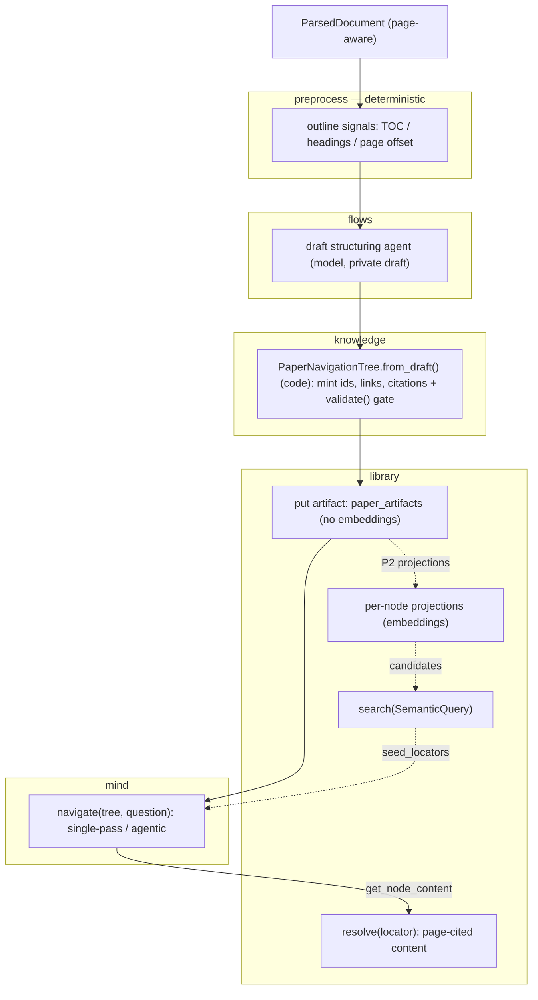
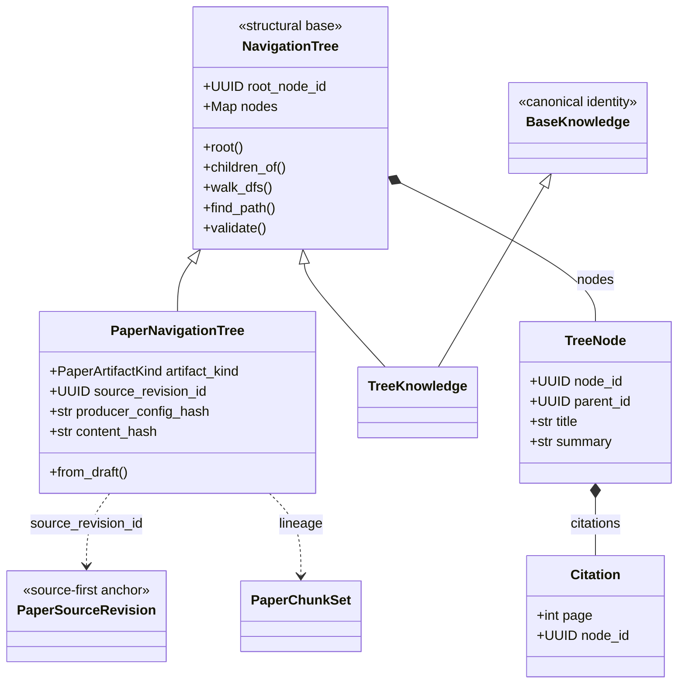

# Build and navigate a page-preserving paper tree

## Quick Summary

- **Purpose**: Define how a source-first paper gains a validated navigation tree
  and how a reasoning agent traverses it, without embeddings replacing reasoning.
- **Read when**: Designing or changing PageIndex-style tree construction, the
  `mind` navigation package, or hybrid semantic-plus-agentic retrieval.
- **Status**: Planned. No implementation exists on `master`. This page records
  the accepted design and refines issue #95 for the source-first Paper Flow V1
  model shipped in #120; the `quantmind.mind` package does not exist yet.
- **Core rule**: One tree implementation. A shared `NavigationTree` base carries
  structure, navigation, and the integrity gate; each document type subclasses it
  for identity. The paper tree is a derived, source-linked artifact whose model
  returns only a draft while code validates every node. Navigation reasons over
  titles and summaries; embeddings are a coarse pre-filter added later, never a
  replacement.
- **Canonical models**: [Paper source and artifact design](../knowledge/paper.md).
- **Related work**: issues #122 (context), #95 (feature request), #71 (`mind`
  scaffold), #120 (source-first Paper Flow V1); prior art `VectifyAI/PageIndex`
  (MIT).

## Contents

- [Motivation](#motivation)
- [Design at a Glance](#design-at-a-glance)
- [Ownership](#ownership)
- [Navigation Tree Base and Paper Binding](#navigation-tree-base-and-paper-binding)
- [Build Pipeline](#build-pipeline)
- [Navigation Retrieval](#navigation-retrieval)
- [Multi-Model Compatibility](#multi-model-compatibility)
- [Hybrid Search Compatibility](#hybrid-search-compatibility)
- [Boundaries and Import Contracts](#boundaries-and-import-contracts)
- [Verification Slice](#verification-slice)
- [Out of Scope](#out-of-scope)

## Motivation

Vector retrieval assumes the passage most similar to a query in embedding space
is the most relevant one. For long, structured financial documents that
assumption breaks: near-identical passages differ on a threshold or exception;
fixed-size chunking fragments a table; a cross-reference such as "see Item 7A"
shares no similarity with its target; and a stateless retriever cannot use prior
reasoning to decide where to look.

Reasoning-based navigation reframes retrieval as relevance classification over a
document's real structure: an agent reads a tree of section titles and
summaries, picks a branch, drills down, and lazily loads leaf text with exact
page provenance. `quantmind.knowledge` already records this as the purpose of
`TreeKnowledge`, and embeddings there "act as a coarse pre-filter, never as a
replacement for that reasoning."

## Design at a Glance

The build spine is solid; the dotted branch is the later hybrid path that adds
embeddings. Each package owns one stage, and every deterministic or code-owned
stage carries no model call.



## Ownership

Each existing package keeps its responsibility; only agentic traversal introduces
a new owner, `mind`. No shared runtime is moved and no second store is added.

| Owner | Responsibility |
|---|---|
| `quantmind.preprocess` | Emit deterministic outline signals (heading candidates, table-of-contents pages, printed-to-physical page offset) from a parsed document. No LLM calls. |
| `quantmind.knowledge` | Add the `NavigationTree` structural base (reused by a refactored `TreeKnowledge`) plus a `PaperNavigationTree(NavigationTree)` artifact whose `from_draft` constructor mints identity and runs the shared integrity gate. |
| `quantmind.flows` | Run one draft-structuring agent and call the knowledge constructor. Reuses `flows._runner` unchanged. Persistence stays explicit. |
| `quantmind.library` | Persist the artifact through the existing paper artifact tables and extend `resolve()` to the new kind. Per-node projections are a separate later step. |
| `quantmind.mind` | Traverse the tree with the Agents SDK and return node evidence. May request a semantic shortlist from `library`. |

`quantmind.rag` is unchanged: it stays deterministic chunking and BM25 with no
LLM dependency and hosts no PageIndex draft producer.

## Navigation Tree Base and Paper Binding

The tree structure is shared across document types; the identity binding is not.
The design factors the two apart so the codebase keeps exactly one tree, not two.



`NavigationTree` is a structural base — a plain `BaseModel` with no
`BaseKnowledge` identity: `root_node_id: UUID`, `nodes: dict[UUID, TreeNode]`, the
navigation surface (`root()`, `children_of()`, `walk_dfs()`, `find_path()`), and
the `validate()` integrity gate. It carries no `id`, `as_of`, or `source`, so a
subclass adds whatever identity its storage model needs without a second
competing identity. The existing `TreeKnowledge` is refactored to
`TreeKnowledge(BaseKnowledge, NavigationTree)` and reuses the same nodes,
helpers, and gate instead of defining its own.

A navigation tree is a derived artifact — rebuildable from a source plus a
producer configuration, like `PaperChunkSet` — not canonical knowledge, so the
paper binding is a paper artifact rather than a `TreeKnowledge` stored as a
knowledge item. `PaperNavigationTree(NavigationTree)` adds:

- `artifact_kind = PaperArtifactKind.NAVIGATION_TREE` and `schema_version`;
- `source_revision_id` binding it to an exact `PaperSourceRevision`;
- a `producer` config (model, prompt version, input chunk-set id, instructions
  hash, structuring bounds) and its `producer_config_hash`;
- a `content_hash` over the canonical tree and lineage to the input
  `PaperChunkSet` via `paper_artifact_lineage`.

A stable, source-and-producer-derived id makes an unchanged re-run idempotent and
versions a changed configuration rather than overwriting it, exactly as the other
paper artifacts behave. A future document type adds its own `NavigationTree`
subclass with its own source binding; nothing paper-specific leaks into the base.

Page ranges reuse `Citation`: a node spanning pages 5-8 carries four
`Citation(page=5..8)` entries on `TreeNode.citations`. No `end_page` field or new
range rule is added. A leaf does not copy chunk text; `TreeNode.content` stays
empty and provenance is a citation pointing at the owning chunk, so source text
is never duplicated into the tree.

## Build Pipeline

Construction mirrors `paper_flow`: deterministic work in code, one bounded model
call for the draft, and code-owned identity and validation.

1. **Outline signals (`preprocess`, deterministic).** From the page-aware
   `ParsedDocument`, detect table-of-contents pages, heading candidates, and the
   printed-to-physical page offset. Emit ordered, page-anchored signals; make no
   LLM call.
2. **Draft structuring (`flows`, one agent).** An agent proposes a private draft
   hierarchy from outline signals and chunk summaries: titles, nesting, per-node
   draft summaries, and candidate chunk indices per node. The draft chooses no
   ids, links, or canonical citations, exactly like the summary draft.
3. **Canonicalization and integrity gate (`knowledge`).**
   `PaperNavigationTree.from_draft(chunk_set, *, producer, draft)` mints node
   ids, builds parent/child links, and resolves each node's `Citation` entries
   from the chunk set, then runs the shared `NavigationTree.validate()` gate. The
   gate rejects any tree that is not single-rooted and acyclic with every node
   reachable, bidirectional parent/child consistency, unique sibling positions,
   no orphan, every cited page within the source, and every child's cited pages
   contained in its parent's. A low structuring-quality signal falls back to a
   flat single-level tree rather than an unverified hierarchy.
4. **Persistence (`library`).** Store the artifact through the paper artifact
   tables. Persistence needs no embeddings.

Steps 1, 3, and 4 have no model dependency and are testable without a network.

## Navigation Retrieval

Navigation lives in `quantmind.mind.navigation` and returns node evidence, never
a synthesized answer:

```text
navigate(tree, question, *, library, cfg, seed_locators=None)
  -> list[NavigationEvidence]
```

`tree` is any `NavigationTree` — a `PaperNavigationTree` today. Navigation is
written against the base, so a future document type reuses it unchanged. Leaf
content is resolved through the existing `LocalKnowledgeLibrary.resolve()`,
extended to the new artifact kind, so no parallel page-resolver concept is added.
Two grains are supported:

- **Single-pass selection.** Serialize the tree with leaf text stripped (ids,
  titles, summaries, hierarchy), make **one** model call for the relevant node
  ids, then resolve their page-cited content in code.
- **Agentic traversal.** Expose two SDK `@function_tool` functions —
  `get_document_structure()` (tree without leaf text) and
  `get_node_content(node_ids)` (page-cited leaf text via `resolve()`) — and let an
  Agent decide, turn by turn, which node to open and when it has enough evidence.

Navigation calls `agents.Runner.run(...)` with its own `RunConfig` directly; it
does not import `flows._runner`. Whole-tree serialization is bounded by a
structure token budget over titles and summaries.

## Multi-Model Compatibility

- **Rely on the SDK.** `cfg.model` (a plain string, including a
  `litellm/<provider>/<model>` value) flows unchanged into the SDK `Runner`,
  which already routes multiple providers. No provider-resolution wrapper is
  added.
- **Capability requirement.** Draft structuring needs reliable structured output
  and agentic traversal needs tool-calling; a provider that lacks the capability a
  stage needs is unsupported for that stage. Tests cover at least one non-OpenAI
  model across both stages.
- **Embeddings.** The hybrid step depends only on the library's existing
  `_EmbeddingProvider` seam and on `SemanticQuery` / `SemanticHit`, never on a
  specific vendor.

## Hybrid Search Compatibility

Hybrid retrieval — shortlist nodes by semantic search, then reason over the
shortlist — is a later, explicit step that reuses locator identity end to end. It
is the only part that needs an embedding provider; build and pure-agentic
navigation do not.

- Building per-node projections is an explicit later step. Once built,
  `search(SemanticQuery(...))` returns `SemanticHit` values that already carry a
  full `ArtifactLocator`; the design keeps the locator and never collapses a hit
  to a bare `node_id`.
- Seeds are validated locators: `navigate(..., seed_locators=...)`. Single-tree
  mode constrains the query with `tree_id = artifact.id` and rejects any seed
  whose artifact id does not match, so a hit from another tree, a flat item, or a
  chunk cannot leak in. Cross-artifact traversal keys seeds by the full
  `(artifact_id, node_id)` locator.
- Embeddings stay a coarse pre-filter: the agent may leave the seeded subtree, and
  a hit never becomes an answer without the reasoning step.

Pure-agentic navigation passes no seeds; hybrid adds one shortlist step in front
of the same primitive.

## Boundaries and Import Contracts

Placement satisfies the existing `import-linter` contracts, which already forbid
`library` and `rag` from importing `quantmind.mind`. When `mind` is implemented,
add one contract pinning `mind -> library -> knowledge`: `mind` may import
`knowledge`, `library`, `configs`, and `utils`, but not `flows`, `magic`, `rag`,
or `preprocess`; `flows` may import `mind`. Nothing moves out of `flows`, and
`rag` keeps its imports-only-`preprocess` rule.

## Verification Slice

Offline tests use fixed generated PDFs and a fake structuring provider. They
cover a clean table of contents, a missing table of contents, a printed
page-number reset, and an in-body cross-reference; integrity rejection of cyclic,
orphaned, and out-of-page-range trees; stable ids and idempotent re-runs; citation
resolution to correct pages; reopen behavior; and, once projections exist, seeded
hybrid navigation with locator validation.

A bounded live slice builds a navigation tree over one exact arXiv revision with a
real model, traverses it single-pass and agentically, and prints the selected
titles, resolved page-cited content, and citation pages. It runs at least one
non-OpenAI model to exercise the capability requirement.

## Out of Scope

- a nested `TreeKnowledge` inside an artifact, a second parallel tree
  implementation, or a `PaperTree` on `Paper`;
- a `Citation.end_page` field or a separate page-resolver concept;
- a shared runtime module or moving `flows._runner`;
- a public retriever, vector-store, provider registry, or query-engine hierarchy;
- a second persistence or semantic-index layer;
- answer synthesis or agent memory inside the navigation primitive;
- corpus-level virtual nodes or query-time tree reconstruction;
- knowledge-graph construction.
