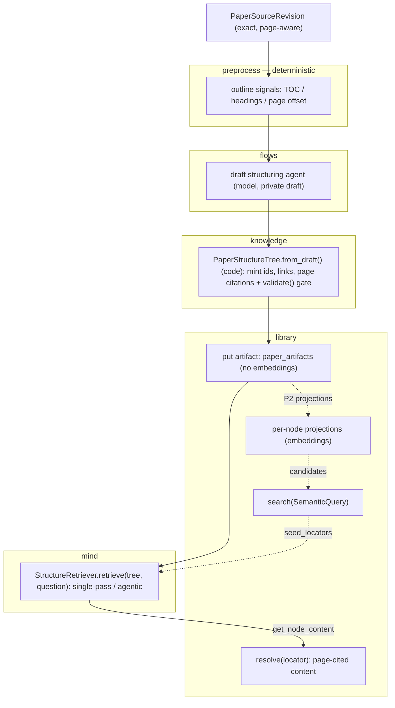
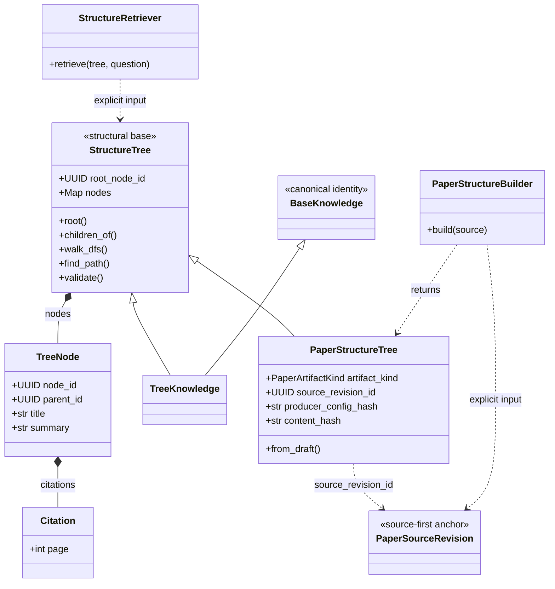

# Build and retrieve from a page-preserving structure tree

## Quick Summary

- **Purpose**: Define how a source-first paper gains a validated structure tree
  and how a reasoning agent traverses it, without embeddings replacing reasoning.
- **Read when**: Designing or changing PageIndex-style tree construction, the
  `mind` retrieval package, or hybrid semantic-plus-agentic retrieval.
- **Status**: Implemented for source-native vectorless P0 build/persistence and
  P1 single-pass/agentic retrieval. Collection routing, P2 semantic node
  projections, and hybrid seeding remain deferred.
- **Core rule**: One tree implementation. A shared `StructureTree` base carries
  structure, traversal, and the integrity gate; each document type subclasses it
  for identity. `PaperStructureBuilder` and `StructureRetriever` are small
  reusable services that bind stable policy while every source, tree, question,
  and result remains explicit. The paper structure tree is derived directly
  from exact source pages, never from a chunk set. Retrieval reasons over titles
  and summaries; embeddings are a coarse pre-filter added later, never a
  replacement.
- **Canonical models**: [Paper source and artifact design](../knowledge/paper.md).
- **Related work**: issues #122 (context), #95 (feature request), #71 (`mind`
  scaffold), #120 (source-first Paper Flow V1); prior art `VectifyAI/PageIndex`
  (MIT).

## Contents

- [Motivation](#motivation)
- [Design at a Glance](#design-at-a-glance)
- [Ownership](#ownership)
- [Structure Tree Base and Paper Binding](#structure-tree-base-and-paper-binding)
- [Build Pipeline](#build-pipeline)
- [Retrieval](#retrieval)
- [Service Boundaries](#service-boundaries)
- [Future Multi-Document Composition](#future-multi-document-composition)
- [Multi-Model Compatibility](#multi-model-compatibility)
- [Hybrid Search Compatibility](#hybrid-search-compatibility)
- [Boundaries and Import Contracts](#boundaries-and-import-contracts)
- [Verification Slice](#verification-slice)
- [Out of Scope](#out-of-scope)

## Motivation

Vector retrieval assumes the passage most similar to a query in embedding space
is the most relevant one. For long, structured financial documents that
assumption breaks: near-identical passages differ on a threshold or exception;
fixed-size chunking fragments a table; a cross-reference such as "see Item 7A"
shares no similarity with its target; and a stateless retriever cannot use prior
reasoning to decide where to look.

Reasoning-based retrieval reframes the problem as relevance classification over a
document's real structure: an agent reads a tree of section titles and
summaries, picks a branch, drills down, and lazily loads leaf text with exact
page provenance. `quantmind.knowledge` already records this as the purpose of
`TreeKnowledge`, and embeddings there "act as a coarse pre-filter, never as a
replacement for that reasoning."

## Design at a Glance

The build spine is solid; the dotted branch is the later hybrid path that adds
embeddings. Each package owns one stage, and every deterministic or code-owned
stage carries no model call.



## Ownership

Each existing package keeps its responsibility; only agentic traversal introduces
a new owner, `mind`. No shared runtime is moved and no second store is added.

| Owner | Responsibility |
|---|---|
| `quantmind.preprocess` | Emit deterministic outline signals (heading candidates, table-of-contents pages, printed-to-physical page offset) from a parsed document. No LLM calls. |
| `quantmind.knowledge` | Add the `StructureTree` structural base (reused by a refactored `TreeKnowledge`) plus a source-bound `PaperStructureTree(StructureTree)` artifact whose `from_draft` constructor mints identity and runs the shared integrity gate. |
| `quantmind.flows` | `PaperStructureBuilder` binds reusable structuring policy, runs one draft-structuring agent per explicit source, and calls the knowledge constructor. Reuses `flows._runner` unchanged. Persistence stays explicit. |
| `quantmind.library` | Atomically persist an exact source plus its vectorless tree and resolve node content directly from cited source pages. Per-node projections are a separate later step. |
| `quantmind.mind` | `StructureRetriever` binds a library and retrieval policy, traverses one explicit tree per call with the Agents SDK, and returns node evidence. A later collection operation may supply candidate trees. |

`quantmind.rag` is unchanged: it stays deterministic chunking and BM25 with no
LLM dependency and hosts no PageIndex draft producer.

## Structure Tree Base and Paper Binding

The tree structure is shared across document types; the identity binding is not.
The design factors the two apart so the codebase keeps exactly one tree, not two.



`StructureTree` is a structural base — a plain `BaseModel` with no
`BaseKnowledge` identity: `root_node_id: UUID`, `nodes: dict[UUID, TreeNode]`, the
traversal surface (`root()`, `children_of()`, `walk_dfs()`, `find_path()`), and
the `validate()` integrity gate. It carries no `id`, `as_of`, or `source`, so a
subclass adds whatever identity its storage model needs without a second
competing identity. The existing `TreeKnowledge` is refactored to
`TreeKnowledge(BaseKnowledge, StructureTree)` and reuses the same nodes,
helpers, and gate instead of defining its own.

A structure tree is a derived artifact — rebuildable from an exact source plus
a producer configuration — not canonical knowledge, so the paper binding is a
paper artifact rather than a `TreeKnowledge` stored as a knowledge item.
`PaperStructureTree(StructureTree)` adds:

- `artifact_kind = PaperArtifactKind.STRUCTURE_TREE` and `schema_version`;
- `source_revision_id` binding it to an exact `PaperSourceRevision`;
- a `producer` config (model, prompt version, instructions hash, physical-page
  text policy, and structuring bounds) and its `producer_config_hash`;
- a `content_hash` over the canonical tree.

A stable, source-and-producer-derived id makes an unchanged re-run idempotent and
versions a changed configuration rather than overwriting it, exactly as the other
paper artifacts behave. A future document type adds its own `StructureTree`
subclass with its own source binding; nothing paper-specific leaks into the base.

Page ranges reuse `Citation`: a node spanning pages 5-8 carries four
`Citation(page=5..8)` entries on `TreeNode.citations`. No `end_page` field or new
range rule is added. A leaf does not copy source text; `TreeNode.content` stays
empty and provenance points directly at the exact source revision and physical
pages, so source text is never duplicated into the tree.

## Build Pipeline

Construction mirrors `paper_flow`: deterministic work in code, one bounded model
call for the draft, and code-owned identity and validation.

1. **Outline signals (`preprocess`, deterministic).** Project the canonical
   page-aware source manifest into `ParsedDocument`, detect table-of-contents
   pages, heading candidates, and the printed-to-physical page offset. Emit
   ordered, page-anchored signals; make no LLM call.
2. **Draft structuring (`flows`, one agent).** `PaperStructureBuilder` proposes
   a private draft hierarchy from outline signals and bounded physical-page
   text: titles, nesting, per-node summaries, and inclusive start/end pages.
   The draft chooses no ids, links, or canonical citations.
3. **Canonicalization and integrity gate (`knowledge`).**
   `PaperStructureTree.from_draft(source, *, producer, draft)` mints node ids,
   builds parent/child links, and resolves each node's physical-page `Citation`
   entries from the source, then runs the shared `StructureTree.validate()` gate. The
   gate rejects any tree that is not single-rooted and acyclic with every node
   reachable, bidirectional parent/child consistency, unique sibling positions,
   no orphan, every cited page within the source, and every child's cited pages
   contained in its parent's. A low structuring-quality signal falls back to a
   flat single-level tree rather than an unverified hierarchy.
4. **Persistence (`library`).** `put_paper_structure_tree(source, tree)` stores
   or reuses the exact source and its tree in one transaction. It requires no
   chunk set, summary, artifact lineage, or embeddings.

Steps 1, 3, and 4 have no model dependency and are testable without a network.

## Retrieval

Retrieval lives in `quantmind.mind.retrieval` and returns node evidence, never
a synthesized answer:

```python
retriever = StructureRetriever(library=library, cfg=cfg)
evidence = await retriever.retrieve(
    structure,
    question,
    seed_locators=seed_locators,
)
```

`structure` is any `StructureTree` — a `PaperStructureTree` today. Retrieval is
written against the base, so a future document type reuses it unchanged. Leaf
content is resolved through the existing `LocalKnowledgeLibrary.resolve()`,
extended to the new artifact kind, so no parallel page-resolver concept is added.
Two grains are supported:

- **Single-pass selection.** Serialize the tree with leaf text stripped (ids,
  titles, summaries, hierarchy), make **one** model call for the relevant node
  ids, then resolve their page-cited content in code.
- **Agentic traversal.** Expose two SDK `@function_tool` functions —
  `get_document_structure()` (tree without leaf text) and
  `get_node_content(node_ids)` (page-cited leaf text via `resolve()`) — and let an
  Agent decide, turn by turn, which node to open and when it has enough evidence.

Retrieval calls `agents.Runner.run(...)` with its own `RunConfig` directly; it
does not import `flows._runner`. Whole-tree serialization is bounded by a
structure token budget over titles and summaries.

## Service Boundaries

The public callable shape follows the repository's hybrid function/object
rule. These services earn a class because their constructor binds dependencies
or policy reused across calls:

- `PaperStructureBuilder` snapshots `PaperStructureCfg` and owns the reusable
  draft provider. `build(source)` receives every active source explicitly and
  returns a frozen tree.
- `StructureRetriever` snapshots `RetrievalCfg` and owns the open library used
  for lazy resolution. `retrieve(tree, question)` receives every active tree,
  question, and seed explicitly and returns evidence.

Neither service stores a current source, tree, question, seed, or result. The
frozen `PaperStructureTree` artifact does not acquire provider, persistence, or
query behavior. There is no builder/retriever base class, registry, or manager
hierarchy.

## Future Multi-Document Composition

One structure tree remains one document index. Multi-document querying is a
later outer composition, not a reason to merge unrelated document nodes into
the single-document artifact:

1. select candidate documents using metadata, document descriptions, existing
   global-summary projections, or a future corpus/file-system tree;
2. load each candidate's `PaperStructureTree` by full artifact identity, using
   a future source-plus-kind lookup with an explicit producer/version policy
   when several tree versions coexist;
3. reuse one `StructureRetriever` to retrieve from each explicit tree;
4. fuse evidence using the full `(source_revision_id, artifact_id, node_id)`
   locator, never a bare node id.

The current release does not implement the collection router or evidence
fusion, nor the source-to-tree lookup convenience API. The current SQLite
schema already stores source revision and artifact kind independently, so that
lookup can be added without changing tree identity. The release guarantees the
remaining extension seam: builder and retriever instances are reusable across
documents, the retriever retains no current-tree state, and seed validation
remains scoped to the explicit tree passed to one call.

## Multi-Model Compatibility

- **Rely on the SDK.** `cfg.model` (a plain string, including a
  `litellm/<provider>/<model>` value) flows unchanged into the SDK `Runner`,
  which already routes multiple providers. No provider-resolution wrapper is
  added.
- **Capability requirement.** Draft structuring needs reliable structured output
  and agentic traversal needs tool-calling; a provider that lacks the capability a
  stage needs is unsupported for that stage. Tests cover at least one non-OpenAI
  model across both stages.
- **Embeddings.** The hybrid step depends only on the library's existing
  `_EmbeddingProvider` seam and on `SemanticQuery` / `SemanticHit`, never on a
  specific vendor.

## Hybrid Search Compatibility

Hybrid retrieval — shortlist nodes by semantic search, then reason over the
shortlist — is a later, explicit step that reuses locator identity end to end. It
is the only part that needs an embedding provider; build and pure-agentic
retrieval do not.

- Building per-node projections is an explicit later step. Once built,
  `search(SemanticQuery(...))` returns `SemanticHit` values that already carry a
  full `ArtifactLocator`; the design keeps the locator and never collapses a hit
  to a bare `node_id`.
- Seeds are validated locators passed to `StructureRetriever.retrieve(...)`.
  Single-tree mode constrains the call to the explicit artifact and rejects any
  seed whose source, artifact id, kind, or member does not match, so a hit from
  another tree, a flat item, or a chunk cannot leak in.
- Embeddings stay a coarse pre-filter: the agent may leave the seeded subtree, and
  a hit never becomes an answer without the reasoning step.

Pure-agentic retrieval passes no seeds; hybrid adds one shortlist step in front
of the same primitive.

## Boundaries and Import Contracts

Placement satisfies the `import-linter` contracts, which forbid `library` and
`rag` from importing `quantmind.mind` and pin `mind -> library -> knowledge`.
`mind` may import
`knowledge`, `library`, `configs`, and `utils`, but not `flows`, `magic`, `rag`,
or `preprocess`; `flows` may import `mind`. Nothing moves out of `flows`, and
`rag` keeps its imports-only-`preprocess` rule.

## Verification Slice

Offline tests use fixed PDFs and fake model outputs. They cover a table of
contents, a missing table of contents, a printed page-number reset, and an
in-body cross-reference; every tree-integrity rejection; stable IDs and
idempotent re-runs independent of splitter configuration; vectorless
source-plus-tree persistence and schema migration; single-pass and agentic
retrieval; citation resolution directly to source pages; reuse of one builder
and retriever across distinct documents; reopen behavior; multi-model identity
forwarding; and seed-locator validation. P2 adds seeded semantic shortlist
quality tests when node projections exist.

## Out of Scope

- a nested `TreeKnowledge` inside an artifact, a second parallel tree
  implementation, or a `PaperTree` on `Paper`;
- a `Citation.end_page` field or a separate page-resolver concept;
- a shared runtime module or moving `flows._runner`;
- a generic retriever hierarchy, vector-store abstraction, provider registry,
  or query-engine hierarchy;
- a second persistence or semantic-index layer;
- answer synthesis or agent memory inside the retrieval primitive;
- collection routing or evidence fusion in this release;
- corpus-level virtual nodes or query-time tree reconstruction;
- knowledge-graph construction.
