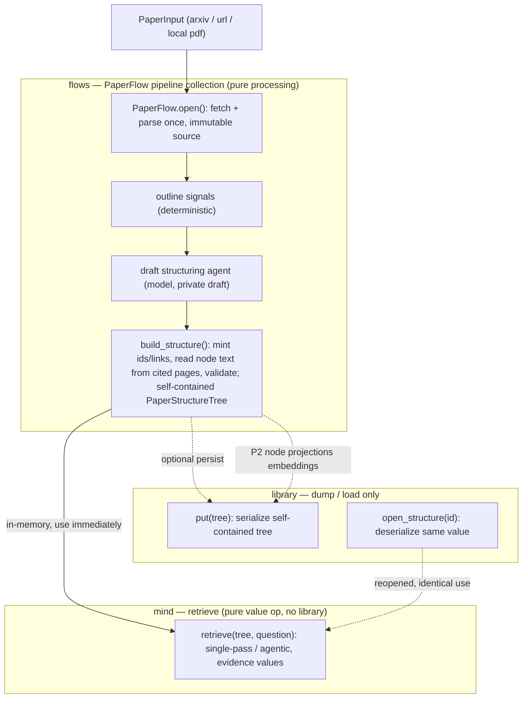

# Build and retrieve from a self-contained structure tree

## Quick Summary

- **Purpose**: Define how a paper becomes a self-contained page-preserving
  structure tree, how that tree is persisted and reopened, and how a reasoning
  agent retrieves evidence from it without embeddings replacing reasoning.
- **Read when**: Designing or changing PageIndex-style tree construction, the
  `PaperFlow` pipeline collection, the `mind` retrieval operation, structure-tree
  persistence, or future hybrid semantic-plus-agentic retrieval.
- **Status**: Redesigned (2026-07). Supersedes the earlier "vectorless empty
  shell + library page refill" design. The structure tree now carries its own
  node content; retrieval is a pure value operation over that tree; the library
  dumps and loads the tree as an independent artifact. Semantic node projections
  and hybrid seeding remain deferred.
- **Core rule**: **Pipelines produce complete, self-contained artifacts;
  persistence and retrieval are separate downstream concerns.** A structure
  tree's nodes carry their own text (and optionally an embedding), so the tree
  is usable the moment a pipeline returns it — in memory, with no library. The
  library only dumps and loads that value; single-tree retrieval reasons over
  the tree value and returns **evidence values**, never a bare reference that
  forces a library round-trip. Retrieval reasons over titles and summaries;
  embeddings are a coarse pre-filter added later, never a replacement.
- **Canonical models**: [Paper source and artifact design](../knowledge/paper.md).
- **Related work**: issues #122 (context), #95 (feature request), #71 (`mind`
  scaffold), #120 (source-first Paper Flow V1); prior art `VectifyAI/PageIndex`
  (MIT).

## Contents

- [Motivation](#motivation)
- [Pipelines vs Components (Altitude)](#pipelines-vs-components-altitude)
- [Design at a Glance](#design-at-a-glance)
- [Ownership](#ownership)
- [Self-Contained Structure Tree](#self-contained-structure-tree)
- [The PaperFlow Pipeline Collection](#the-paperflow-pipeline-collection)
- [Persistence: Dump / Load Symmetry](#persistence-dump-load-symmetry)
- [Retrieval Returns Values, Not References](#retrieval-returns-values-not-references)
- [Callable Shape](#callable-shape)
- [Future Multi-Document Composition](#future-multi-document-composition)
- [Multi-Model Compatibility](#multi-model-compatibility)
- [Hybrid Search Compatibility](#hybrid-search-compatibility)
- [Boundaries and Import Contracts](#boundaries-and-import-contracts)
- [Verification Slice](#verification-slice)
- [Out of Scope](#out-of-scope)

## Motivation

Vector retrieval assumes the passage most similar to a query in embedding space
is the most relevant one. For long, structured financial documents that
assumption breaks: near-identical passages differ on a threshold or exception;
fixed-size chunking fragments a table; a cross-reference such as "see Item 7A"
shares no similarity with its target; and a stateless retriever cannot use prior
reasoning to decide where to look.

Reasoning-based retrieval reframes the problem as relevance classification over a
document's real structure: an agent reads a tree of section titles and
summaries, picks a branch, drills down, and reads leaf text with exact page
provenance. `quantmind.knowledge` already records this as the purpose of
`TreeKnowledge`, and embeddings there "act as a coarse pre-filter, never as a
replacement for that reasoning."

The earlier build of this feature made the tree an *empty shell*: nodes stored
only titles, summaries, and page citations, and leaf text was refilled at query
time from the library via `resolve(locator)`. That coupled two things that
should be independent — the tree artifact and the store — and made single-tree
retrieval impossible without a library. This design removes that coupling.

## Pipelines vs Components (Altitude)

This feature is the worked example for the repository's altitude rule (see
[operations/orchestration.md](../operations/orchestration.md)). Two layers, two
jobs:

- **Pipelines** (`quantmind.flows`) are finished, batteries-included workflows.
  A caller states an intent — "turn this paper into a structure tree" — and gets
  back a **complete, self-contained artifact**. A pipeline is pure processing:
  `input → artifact`. It does **not** bind a library, persist anything, or
  retrieve. Producing the artifact fully — including any embeddings it carries —
  is the pipeline's job.
- **Components** (`knowledge`, `preprocess`, `rag`, `library`, `mind`) are the
  building blocks. A caller who wants only an intermediate (just the parsed
  source, just chunks) uses a component directly and wires it themselves. A
  half-finished intermediate is **not** promoted to a public pipeline.

Persistence (`library`) and retrieval (`mind`) are **downstream** of a pipeline,
not part of it. A structure tree returned by `PaperFlow.build_structure()` is
immediately usable; putting it in a library and retrieving from it are separate,
optional steps a caller chooses.

## Design at a Glance

The build spine is solid; the dotted branch is the later hybrid path that adds
embeddings. Processing (including any embeddings) belongs to the pipeline;
`library` only stores and loads; `mind` only retrieves.



## Ownership

| Owner | Responsibility |
|---|---|
| `quantmind.preprocess` | Emit deterministic outline signals (heading candidates, table-of-contents pages, printed-to-physical page offset) from a parsed document. No LLM calls. |
| `quantmind.flows` (`PaperFlow`) | A collection of finished paper pipelines over one immutable source. `open()` fetches and parses once. `build_structure()` runs one draft-structuring agent, then mints identity, reads each node's text from its cited source pages, and validates — returning a **self-contained** `PaperStructureTree`. `extract_knowledge()` produces the chunk-set + cited summary. No persistence, no retrieval, no library. |
| `quantmind.knowledge` | Own the `StructureTree` structural base and the source-bound `PaperStructureTree` artifact. `from_draft` mints identity, resolves page citations, **and populates each node's `content` from the exact source pages**, then runs the integrity gate. The artifact is a complete value. |
| `quantmind.library` | Dump a self-contained tree and load it back unchanged (`put` / `open_structure`). A tree is an **independent** artifact: its library need not contain a chunk set, and loading it never depends on refilling text from another artifact. |
| `quantmind.mind` | `retrieve(tree, question)` reasons over one explicit tree value and returns evidence values with content already in them. It does **not** take or bind a library. |

`quantmind.rag` is unchanged: deterministic chunking and BM25, no LLM, no
PageIndex producer.

## Self-Contained Structure Tree

`StructureTree` stays the shared structural base (a plain `BaseModel`:
`root_node_id`, `nodes`, the `root()` / `children_of()` / `walk_dfs()` /
`find_path()` traversal surface, and the `validate()` integrity gate). Identity
is added by subclasses.

The change is in what a node holds. `TreeNode` already has a
`content: str | None` field; the previous design **forbade** populating it
(`PaperStructureTree` raised "nodes must not copy content"). That rule is
**inverted**:

- A `PaperStructureTree` leaf node **carries its own `content`** — the text of
  the physical source pages it cites, read from the exact source revision at
  build time. The tree is self-contained: it no longer depends on the source
  revision or a chunk set to yield node text.
- A node **may** additionally carry an optional `embedding` (reserved for the
  later hybrid path). Pure agentic retrieval does not need it; when present it is
  produced by the pipeline and persisted with the tree, never computed at
  `library.put` time.
- `content_hash` now covers node content (it already hashes the full node dump),
  so a self-contained tree versions by its content as expected.
- The redundancy is deliberate and accepted: a structure tree is a derived,
  rebuildable artifact; carrying its own text in a local knowledge base is worth
  far more (self-contained, independently retrievable, dump/load symmetric) than
  the storage saved by an empty shell.

Page ranges still reuse `Citation`: a node spanning pages 5-8 carries four
`Citation(page=5..8)` entries. The integrity gate still requires single-rooted,
acyclic, fully reachable topology; bidirectional parent/child links; unique
sibling positions; every cited page inside the source; and every child's pages
contained in its parent's. The only relaxed rule is the content prohibition.

A future document type adds its own `StructureTree` subclass with its own source
binding and its own content-population step; nothing paper-specific leaks into
the base.

## The PaperFlow Pipeline Collection

`PaperFlow` is a domain object that groups the finished paper pipelines and
shares the one expensive step they have in common — fetch + parse — across them.
It is the blessed "immutable document-scoped handle": bound state is set once at
`open()` and never mutated; every method is a pure derivation of it.

```python
from quantmind.flows import PaperFlow
from quantmind.configs import PaperFlowCfg, PaperStructureCfg

paper = await PaperFlow.open(LocalFilePath(path=pdf))          # fetch + parse ONCE
tree  = await paper.build_structure(cfg=PaperStructureCfg())   # self-contained PaperStructureTree
result = await paper.extract_knowledge(cfg=PaperFlowCfg())     # chunk-set + cited summary
```

Rules:

- `open()` performs fetch + parse and stores an **immutable** source revision
  (and the parsed document needed by chunking). No method mutates it.
- Each pipeline method is a pure `→ artifact` derivation and takes its own cfg.
  A method carries no "current result" state between calls.
- `PaperFlow` binds **no** library, persists nothing, and does not retrieve. It
  is pure processing.
- The existing `paper_flow(input, *, cfg)` function stays as a thin
  compatibility wrapper delegating to `PaperFlow.open(...).extract_knowledge()`;
  it is not removed in this change.
- A caller who wants only the parsed source uses `quantmind.preprocess`
  directly; "parse only" is a component seam, not a public pipeline.

## Persistence: Dump / Load Symmetry

Because the tree is a self-contained value, the library reduces to dump/load:

```python
paper = await PaperFlow.open(source_input)
tree  = await paper.build_structure()           # in-memory, immediately usable

await library.put(tree)                          # dump: nodes, text, embeddings
tree2 = await library.open_structure(tree.id)    # load: identical value object
```

- `library.put(tree)` serializes the whole self-contained tree (structure, node
  text, and any node embeddings). It does **not** require the source revision or
  a chunk set to be present, though callers may store the source separately for
  provenance.
- `library.open_structure(tree_id)` (name chosen by the library owner; may reuse
  the existing `get_paper_artifact` path) returns the same
  `PaperStructureTree` value, embeddings included.
- The library is one store holding **independent** artifacts side by side —
  `PaperSourceRevision`, `PaperChunkSet`, `PaperStructureTree`. A tree does not
  imply a chunk set and vice versa.
- The old `resolve(locator)` **text-refill** path for structure-tree nodes is no
  longer how retrieval gets content. `resolve` may remain for cross-document
  reference resolution (see below), but single-tree retrieval never uses it.

## Retrieval Returns Values, Not References

Single-tree retrieval is a **pure value operation** over a self-contained tree:

```python
from quantmind.mind import retrieve
from quantmind.configs import RetrievalCfg

evidence = await retrieve(tree, "What are the method and limitations?",
                          cfg=RetrievalCfg(grain="agentic"))
for item in evidence:
    print(item.title, item.content)     # content is already here; no library
```

`RetrievalEvidence` carries the **value**, with the reference as an optional
provenance field, not the path to the content:

```python
class RetrievalEvidence(BaseModel):
    title: str
    content: str                            # value: self-contained, ready to use
    citations: tuple[Citation, ...]         # value: provenance to source pages
    locator: ArtifactLocator | None = None  # optional: for cross-artifact fusion
```

Why this shape resolves the reference dilemma: if retrieval returned a bare node
**reference**, the consumer would have to resolve it against a library, making
every single-tree retrieval library-dependent. Because the tree is
self-contained, retrieval reads `tree.nodes[id].content` directly and returns
it. The `locator` is there for when a caller *wants* to fuse or re-open across
artifacts — an optional capability, never the only way to see content.

Two grains, both library-free:

- **Single-pass selection.** Serialize the tree (ids, titles, summaries,
  hierarchy — leaf text stripped for the budget), make **one** model call for the
  relevant node ids, then read those nodes' content from the tree.
- **Agentic traversal.** Expose two SDK `@function_tool` functions —
  `get_document_structure()` (tree without leaf text) and
  `get_node_content(node_ids)` (leaf text read from `tree.nodes`) — and let an
  Agent decide, turn by turn, which node to open and when it has enough evidence.
  `get_node_content` reads from the in-memory tree, **not** a library.

`retrieve` calls `agents.Runner.run(...)` with its own `RunConfig`; it does not
import `flows._runner`. Serialization is bounded by a structure token budget.
Seeds (when a hybrid shortlist eventually supplies them) are **in-tree node
ids**, validated against `tree.nodes`; they do not carry a library dependency.

## Callable Shape

The public shape follows the repository's altitude rule
([operations/naming.md](../operations/naming.md)):

- `retrieve(tree, question, *, cfg, seed_node_ids=None)` is a **function**, not a
  class. The earlier `StructureRetriever` class existed only to bind a library;
  once the tree is self-contained and retrieval takes no library, there is no
  reusable construction-time dependency left to bind, so a function is the honest
  shape. If a future semantic or hybrid grain needs a bound embedding provider,
  introduce a small service **then**, not preemptively.
- `retrieve` dispatches on `cfg.grain` (`single-pass` / `agentic`) today, over a
  `StructureTree`. The intended destination is one `retrieve` that also selects
  **semantic** search for a vector-backed knowledge shape and **hybrid** when
  both are available. That widening is documented here and left as
  `NotImplementedError` seams; a single function that branches on cfg/knowledge
  kind is **not** the forbidden "generic retriever / query-engine hierarchy" —
  the prohibition is on class trees and registries, not on internal dispatch.
- `PaperFlow` is a class because `open()` binds one immutable source reused by
  several pipeline methods — a genuine shared, construction-time dependency.

## Future Multi-Document Composition

References and the library earn their keep at **corpus scale**, which is exactly
where single-tree value retrieval stops fitting in memory:

1. select candidate documents using metadata, descriptions, or global-summary
   projections;
2. `library.open_structure(...)` each candidate tree by identity;
3. reuse one `retrieve(tree, question)` per explicit tree;
4. fuse evidence using the full `(source_revision_id, artifact_id, node_id)`
   locator carried on each `RetrievalEvidence`.

Here the `locator` field and library-backed `resolve` are the right tools:
you cannot hold thousands of trees in memory, so you shortlist by reference and
open on demand. The current release does not implement the collection router or
evidence fusion; the seam is the optional `locator` on evidence plus
independent per-artifact persistence.

## Multi-Model Compatibility

- **Rely on the SDK.** `cfg.model` (a plain string, including a
  `litellm/<provider>/<model>` value) flows unchanged into the SDK `Runner`.
- **Capability requirement.** Draft structuring needs reliable structured output;
  agentic traversal needs tool-calling. A provider lacking a stage's capability
  is unsupported for that stage. Tests cover at least one non-OpenAI model.
- **Embeddings.** The later hybrid step depends only on the library's existing
  embedding seam and on `SemanticQuery` / `SemanticHit`, never on a specific
  vendor.

## Hybrid Search Compatibility

Hybrid retrieval — shortlist nodes by semantic search, then reason over the
shortlist — is a later, explicit step. Node embeddings are produced **by the
pipeline** and persisted **with the tree** (not computed at `put` time), so the
tree stays self-contained end to end. Two independent embedding sets can then
coexist in one library — chunk-set embeddings and structure-node embeddings —
and hybrid queries both. Seeds remain validated in-tree node ids; a hit never
becomes an answer without the reasoning step.

## Boundaries and Import Contracts

- `library` and `rag` must not import `quantmind.mind`.
- `mind` may import `knowledge`, `configs`, and `utils`. It **no longer needs to
  import `library`** for retrieval: single-tree `retrieve` is library-free. The
  existing `mind -> library` allowance may stay for the future collection path,
  but the retrieval operation must not depend on it.
- `flows` is the apex and may import `knowledge`, `preprocess`, `rag`, `configs`,
  `mind`, and `utils`. `PaperFlow` imports no library.
- Update the `import-linter` contracts if the `mind -> library` edge is dropped
  from the retrieval path; keep every other edge intact.

## Verification Slice

Offline tests use fixed PDFs and fake model outputs. They cover: a table of
contents, a missing table of contents, a printed page-number reset, and an
in-body cross-reference; every tree-integrity rejection; **node content
populated from cited pages and preserved through dump/load**; stable IDs and
idempotent re-runs; a tree persisted and reopened as an identical self-contained
value **without any chunk set present**; single-pass and agentic retrieval
returning evidence **whose content comes from the tree, with no library
involved**; `PaperFlow.open` parsing once and `build_structure` /
`extract_knowledge` sharing it; multi-model identity forwarding; and in-tree
seed validation. P2 adds seeded semantic-shortlist tests once node projections
exist.

## Out of Scope

- an empty-shell tree or a query-time text-refill path;
- a nested `TreeKnowledge` inside an artifact, or a second parallel tree
  implementation;
- a `Citation.end_page` field or a separate page-resolver concept;
- a shared runtime module or moving `flows._runner`;
- a generic retriever hierarchy, vector-store abstraction, provider registry, or
  query-engine hierarchy (a single `retrieve` that branches on cfg/kind is not
  this);
- answer synthesis or agent memory inside the retrieval primitive;
- collection routing or evidence fusion in this release;
- knowledge-graph construction.
