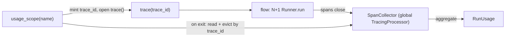

# Collect per-run token and timing usage from SDK traces

## Quick Summary

- **Purpose**: Answer "how many tokens, how long, and how many LLM steps did one flow run take" by reading the traces the Agents SDK already emits — not by hand-rolling a second accounting path.
- **Read when**: Adding usage/latency visibility to a flow, wiring a run-usage readout into a runbook or `batch_run`, or debugging why a flow's reported tokens or step count look wrong.
- **Owner**: `quantmind/utils/usage.py` (`usage_scope`, `SpanCollector`, `RunUsage`, `UsageStep`). A leaf helper; every package and user runbook may import it.
- **Status**: Planned — this page is the agreed design contract for the implementation, not yet-shipped behavior. It lists current gaps and the one open decision inline.
- **Core rule**: Observe, never enforce. This reads the SDK's spans after the fact; it never counts tokens to change what a run does (no budget, no cost).

## Contents

- [Motivation](#motivation)
- [What the SDK Already Provides](#what-the-sdk-already-provides)
- [Collecting One Run](#collecting-one-run)
- [What a Run Reports](#what-a-run-reports)
- [Layer Boundary and Non-Enforcement](#layer-boundary-and-non-enforcement)
- [Scope, Non-Goals, and Planned Work](#scope-non-goals-and-planned-work)
- [Verification](#verification)

## Motivation

Every flow LLM call returns a `RunResult` whose `context_wrapper.usage` already carries input/output/total tokens and a `requests` count, but the flow returns only its domain artifact (`PaperStructureTree`, `PaperSemanticResult`) and drops the `RunResult`. So today there is no answer to a basic optimization question: for one `PaperFlow(cfg).build(input)`, how many tokens did it burn, how long did it take, and how many model calls did it make.

Two facts make a naive `return result.context_wrapper.usage` insufficient:

- **One flow run is many SDK runs.** The semantic build's summary fans out one research agent per chunk group with `asyncio.gather`, then runs one reducer — `N + 1` separate `Runner.run` calls. A structure build that hits the `json_schema` → `json_object` fallback is two calls. The usage of "one flow run" is a sum across several runs, so it must be aggregated, not read from a single result.
- **Concurrency makes a summed duration lie.** Those `N` researchers run in parallel; summing their wall times over-reports latency several-fold. Real end-to-end time and summed busy time are different numbers, and optimization needs both.

Cost is explicitly out of scope: this reports tokens, time, and steps only. Pricing changes per provider and per week; a caller who wants dollars multiplies tokens by their own rate table. See [Non-Enforcement](#layer-boundary-and-non-enforcement).

## What the SDK Already Provides

The Agents SDK ships tracing that already models exactly this data, so the design **consumes** it rather than rebuilding it:

- A `Runner.run` opens a **trace** (unless one is already active) containing typed **spans**. Each span carries `started_at` / `ended_at` timestamps, `trace_id` / `span_id` / `parent_id` (a tree — the shape a waterfall needs), and an `error`.
- Token usage lives on the model spans. Depending on the provider route the SDK emits one of two shapes: a **generation span** (Chat Completions route, e.g. LiteLLM/DeepSeek) carries `usage` directly; a **response span** (Responses API route) carries the full response whose `usage` is read off it. The collector must read **both** shapes, or one provider path silently reports zero tokens.
- `add_trace_processor(p)` registers a `TracingProcessor` that receives every span via `on_span_end`. This is the SDK's documented extension point and the one CLAUDE.md prescribes ("external processors via `add_trace_processor()`").

Because timestamps and usage come from the SDK's own spans, this design mints no clock and stamps no time of its own — the "which clock" question dissolves. A generation/response span is a superset of the per-step record we want; a hand-rolled timer around `run_with_observability` would be a weaker duplicate that also misses retries, tool calls, and sub-turns the spans already capture.

## Collecting One Run

Three parts, each doing one thing:



- **`SpanCollector`** is one process-global `TracingProcessor`, registered once (idempotently) via `add_trace_processor`. Its `on_span_end` buckets each span under its `trace_id`. Bucketing by `trace_id` is what makes concurrent scopes and `batch_run` fan-out safe: each scope only ever reads its own trace.
- **`usage_scope(workflow_name)`** is a sync context manager (like `trace()`). On enter it mints a `trace_id` with `gen_trace_id()` and opens `trace(workflow_name, trace_id=...)`, so every `Runner.run` inside — all `N + 1` of them, plus any fallback retry — nests into **one** trace. On exit it reads that trace's spans out of the collector, aggregates them into a `RunUsage`, and **evicts** them so the collector never grows unbounded.
- The caller reads the result **after** the block, once spans have flushed:

  ```python
  from quantmind.utils.usage import usage_scope

  with usage_scope("quantmind.paper") as u:
      tree = await PaperFlow(cfg).build(input)

  print(u.usage.total_tokens, u.usage.requests, u.usage.wall_seconds)
  for step in u.usage.steps:            # the per-step detail optimization needs
      print(step.label, step.model, step.total_tokens, step.duration_seconds)
  ```

**Additive, never destructive (the one open decision).** `usage_scope` uses `add_trace_processor` to *add* a local, in-memory sink; it never calls `set_trace_processors` (which would evict the user's own processors) and never touches the default backend exporter. Whether spans *also* go to OpenAI's dashboard stays the user's existing global choice (their `OPENAI_API_KEY`, or `set_tracing_disabled()`), not something this library forces on or off. This is the recommended default and the single behavior to confirm before implementation.

## What a Run Reports

`RunUsage` is the per-flow-run aggregate the caller reads; `UsageStep` is one model span within it. Both are frozen value objects (dataclasses), not LLM-facing, so no Pydantic.

- `RunUsage`: `input_tokens`, `output_tokens`, `total_tokens`, `requests` (the count of model spans — **this is "llm-steps"**), `wall_seconds` (`max(ended_at) − min(started_at)` across the trace — true latency), `busy_seconds` (sum of per-step durations — total model-busy time), and `steps: list[UsageStep]`. The gap between `busy_seconds` and `wall_seconds` is how much parallelism the fan-out actually bought — the headline signal for tuning `summary_concurrency`.
- `UsageStep`: `label` (the agent name), `model`, `input_tokens`, `output_tokens`, `total_tokens`, `started_at`, `ended_at`, `duration_seconds`, and `span_id` / `parent_id` so a caller can rebuild the span tree for a waterfall without re-reading the SDK.

Per-step is deliberate: a lump `total_tokens=53k` cannot tell you the reducer dwarfs the researchers, or that one retry doubled a call. The list is the point; the totals are its reduce.

## Layer Boundary and Non-Enforcement

- **Home is `utils` (a leaf).** Like `utils/structured_output.py`, this wraps an Agents SDK seam, depends on nothing else in `quantmind`, and is imported by `flows`, by user runbooks, and later by `mind` — without any package importing `flows`. The import-linter leaf contract on `utils` already guards this.
- **Observation only — no accountant.** This never inspects usage *during* a run to steer it, cap it, or price it. That keeps it clear of the incoherent middle in [orchestration](../operations/orchestration.md#principle-2-agentic-vs-deterministic-orchestration): a concurrency-safe token accountant bolted onto a run to make it behave is a sign the task wanted deterministic decomposition, not observability. Budgets and cost are separate features and are not designed here.

## Scope, Non-Goals, and Planned Work

- **In scope now: flow LLM calls.** Paper structure and paper summary route every model call through `run_with_observability`, and both are single-turn per `Runner.run`, so per-run spans are per-call spans — enough for an accurate token count, step count, and concurrency waterfall today.
- **Not covered in v1: agentic seams.** `mind.retrieval` and `magic` call `Runner.run` directly and multi-turn. `usage_scope` would still trace them if wrapped, but a single agentic run collapses many internal LLM/tool events into one bar; faithful per-call resolution there is future work. The `UsageStep` shape is a degenerate span on purpose, so extending coverage does not change the reader API.
- **No cost, no budget.** Tokens/time/steps only; no pricing table and no `max_total_*` enforcement.
- **Planned: `batch_run` aggregation.** Each input gets its own `usage_scope` (its own `trace_id`), an outer `group_id` ties the batch together, and the per-input `RunUsage` objects populate `BatchResult` (reviving its currently unused `tokens_total`). Not part of the first cut.

## Verification

Offline (`tests/utils/test_usage.py`): feed hand-built generation and response spans (both usage shapes, plus a nested agent span for `label`) through `SpanCollector.on_span_end`, then assert `RunUsage` sums tokens, counts `requests`, derives `wall_seconds` from the min/max timestamps and `busy_seconds` from the per-step sum, and orders `steps`. Assert `usage_scope` mints a distinct `trace_id` per entry, evicts its bucket on exit, and that two concurrent scopes never read each other's spans. A flow-level test wraps a mocked `Runner.run` in `usage_scope` and checks the `N + 1` summary runs land in one `RunUsage`. Live coverage rides on the existing paper E2E script rather than a new one.
