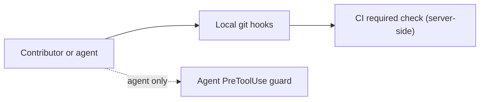

# Harness engineering

## Quick Summary

- **Purpose**: Explain how QuantMind keeps contributors and coding agents on the same rules, which enforcement layer catches whom, and how the same rule is expressed for both Claude Code and Codex without maintaining two copies of its content.
- **Read when**: Adding or changing a hook, a rule, a CI gate, or any `AGENTS.md` / `CLAUDE.md` / skill guidance; or deciding whether a new rule should be advisory (a rule) or a hard guarantee (a hook).
- **Load next**: For contexts-page rules, `.claude/skills/quantmind-dev/references/write-contexts.md`; for commit and PR rules, the `quantmind-dev` skill references.
- **Status**: Current, except the `CLAUDE.md` = `@AGENTS.md` single-source change, which is planned (it needs a matching `tests/test_contexts.py` update and lands separately).

## Contents

- [Enforcement Layers](#enforcement-layers)
- [Mechanism Map Across Claude and Codex](#mechanism-map-across-claude-and-codex)
- [Align Content First, Behavior Only for Guarantees](#align-content-first-behavior-only-for-guarantees)
- [What This Repo Enforces](#what-this-repo-enforces)
- [References](#references)

## Enforcement Layers

Enforcement is layered by *who it can catch*, not by tool. A public library has external contributors who never installed our local hooks and may commit from a raw terminal, so the only universal floor is server-side CI.

| Layer | Mechanism | Catches | Role |
|---|---|---|---|
| CI (server-side) | `.github/workflows/ci.yml` running `scripts/verify.sh` as a required check | Everyone, unskippable | The floor. The only guarantee for external contributors. |
| Local git hooks | `.pre-commit-config.yaml` (`commit-msg`, pre-commit, pre-push) | Whoever ran `pre-commit install`; agents that shell out to `git` | Fast local feedback; not relied on for external contributors. |
| Agent controls | `.claude/rules/`, `.claude/settings.json` hooks, `.codex/hooks.json` | Only agents running in the repo | Legibility and process guards for Claude Code / Codex; never the floor. |

The consequence for design: put the *guarantee* for anything that must hold for every contributor in CI. Local git hooks and agent controls are developer-experience layers on top, valuable but never the sole line of defense.

## Mechanism Map Across Claude and Codex

The two agents expose similar capabilities under names that do **not** line up. The word "rules" in particular means different things on each side, so map by *purpose*, not by name.

| Purpose | Claude Code | Codex |
|---|---|---|
| Always-on project instructions | `CLAUDE.md` | `AGENTS.md` |
| Path- or area-scoped instructions | `.claude/rules/*.md` with a `paths:` glob | Nested `AGENTS.md` in the subdirectory (directory-scoped, coarser) |
| Command allow / deny / ask | `permissions` in settings | `.codex/rules/*.rules` (Starlark `prefix_rule`) |
| Lifecycle enforcement / dynamic gating | Hooks (`.claude/settings.json`) | Hooks (`.codex/hooks.json`), behind `[features] hooks` + per-user `/hooks` trust approval |

Two asymmetries this repo lives with:

- **Codex has no per-file path-scoped instruction rule.** Its closest match to `.claude/rules/` is a nested `AGENTS.md`, loaded by directory proximity rather than by glob on the edited file. We do not hard-add a parallel Codex file for every Claude rule; instead the rule's content lives in one canonical place and the Claude rule points at it (see the next section).
- **Codex "rules" are an execution-policy allowlist**, the analogue of Claude Code's `permissions`, not of `.claude/rules/`. Do not confuse the two when reading either config.

## Align Content First, Behavior Only for Guarantees

Alignment has two levels. **Content alignment** means both agents get the *same rule from one source*; **behavior alignment** means the *trigger and mechanics are identical* on both. Content alignment is almost always enough and costs nothing; behavior alignment costs a shared hook script plus, on Codex, a feature flag and a trust prompt. Reach for behavior alignment only when a rule must be a hard, every-time guarantee.

- **Advisory guidance** (how to write a contexts page) uses each platform's native rule mechanism, both pointing at one canonical source. A declarative rule is loaded once when a matching file is opened, so it adds no per-edit subprocess and does not re-inject when several files are edited.
- **Hard guarantees** (do not bypass verification) use a shared hook script invoked from both `.claude/settings.json` and `.codex/hooks.json`, so the behavior is identical for both agents.

Canonical sources — each rule's content lives in exactly one file:

| Rule | Single source | Claude route | Codex route |
|---|---|---|---|
| Contexts authoring standard | `.claude/skills/quantmind-dev/references/write-contexts.md` | `.claude/rules/contexts-authoring.md` (`paths: contexts/**`) | Read via the skill reference; no parallel file added |
| Commit message convention | `.claude/skills/quantmind-dev/references/commit.md` | `commit-msg` git hook (fires when the agent shells out to `git`) | Same `commit-msg` git hook |
| No verification bypass | `scripts/hooks/pre_tool_use_no_bypass.py` | `.claude/settings.json` PreToolUse | `.codex/hooks.json` PreToolUse |

Known duplication to resolve later: `write-contexts.md` (and the other skill references) exist as identical copies under both `.claude/skills/` and `.agents/skills/`; a single-source consolidation is future work.

## What This Repo Enforces

Each rule is enforced at the layer that fits it, and hooks are kept to mechanical checks only — never semantic judgement.

| Rule | Mechanism | Layer |
|---|---|---|
| Correctness (ruff, basedpyright, import-linter, pytest) | `scripts/verify.sh` | CI required check + pre-push git hook |
| Contexts page structure (Quick Summary / Contents / anchors / index links) | `tests/test_contexts.py` inside `verify.sh` | CI + local |
| English Conventional Commit subject | `scripts/hooks/commit_msg_check.py` | `commit-msg` git hook (tool-agnostic: humans, Claude, Codex) |
| No `--no-verify` bypass of the hooks above | `scripts/hooks/pre_tool_use_no_bypass.py` | Agent PreToolUse hook |

The anti-bypass hook is the one guarantee that cannot live in a git hook: `--no-verify` is by definition the flag that turns git hooks off, and CI only notices after the fact. A PreToolUse `deny` stops an agent from skipping the checks at the source. It is a pure mechanical check (a `git` command carrying `--no-verify`) and shared by both agents through one script. Commit-*message* format, by contrast, is a git hook rather than an agent hook, so it also catches a human committing from a terminal.

Planned next: enforce the commit convention for external contributors at the CI floor (a PR-title lint), since local git hooks only fire for contributors who ran `pre-commit install`.

## References

- Claude Code best practices — mechanism selection, context economy, hooks as deterministic guarantees: <https://code.claude.com/docs/en/best-practices>
- Claude Code path-scoped rules (`.claude/rules/`): <https://code.claude.com/docs/en/memory#organize-rules-with-claude/rules/>
- Codex hooks (lifecycle events, deny / context injection, `[features] hooks`, `/hooks` trust): <https://learn.chatgpt.com/docs/hooks>
