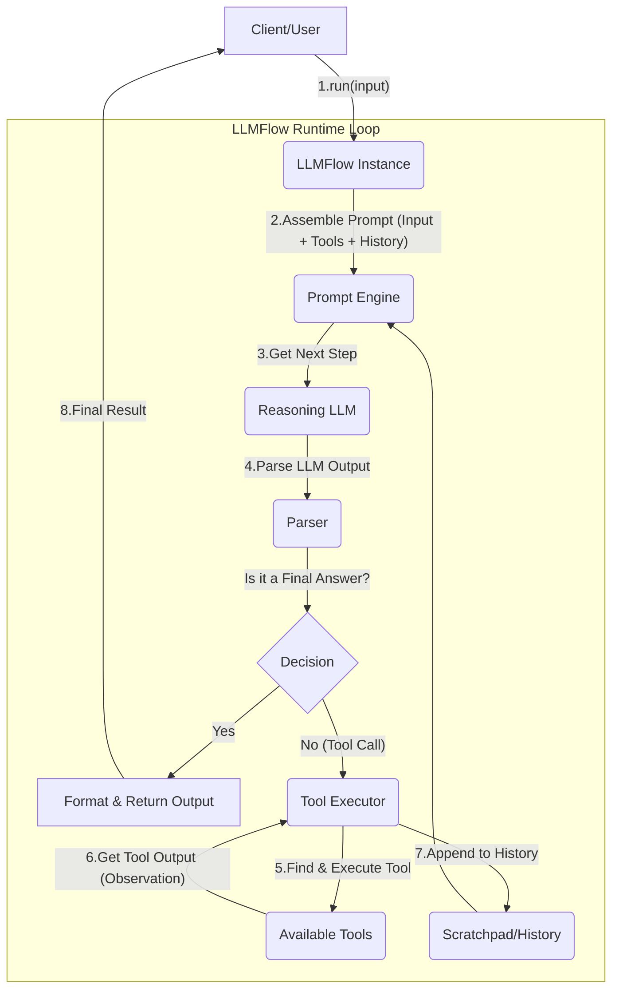

- Author: @Keli
- Time: August 2, 2025
- Reviewer (feel free to add your name):
- Status: **Running**
- Useful Links:
    - Issue: https://github.com/LLMQuant/quant-mind/issues/47
    - https://github.com/LLMQuant/quant-mind/blob/master/quantmind/config/flows.py

## **1. TL;DR**

- **Problem:** The current `BaseFlow` is a **statically orchestrated** framework. Its execution paths are **hard-coded in Python**, making it unable to **dynamically respond to tasks, leverage external capabilities, or perform autonomous planning**. This limits QuantMind's ability to solve complex financial analysis tasks that require **multi-step reasoning and interaction with the external world**.
- **Solution:**
    1. **Introduce the `BaseTool` Abstraction**: Define a standardized tool interface that allows any capability to clearly **"self-describe"** its function, name, and required parameters to an LLM. This will be the cornerstone for integrating QuantMind into the broader agentic ecosystem.
    2. **Create `LLMFlow`**: Design a new `BaseFlow` subclass that embeds an **Agent Runtime**. Instead of executing predefined Python logic, this runtime operates in a loop, using an LLM to reason, parse its intent, and execute the appropriate `Tool` until the task is complete.
- **Impact:**
    - **Unlock Agentic Capabilities**: Enable QuantMind to execute dynamic, LLM-driven task chains, such as "Query NVDA's latest earnings report, extract key metrics, and compare them to the previous quarter."
    - **Enhance Framework Extensibility**: The standardized `BaseTool` interface will allow for easy integration of internal or third-party tools (e.g., data APIs, calculation libraries, **and even tools built with other agentic frameworks**).
    - **Maintain a Balance of Simplicity and Stability**: Retain the stability and predictability of the existing `BaseFlow` for deterministic tasks while providing the powerful `LLMFlow` for scenarios requiring greater flexibility.
- **Existing `BaseFlow` Design:** [QuantMind `flow` Design Docs](https://www.notion.so/QuantMind-flow-Design-Docs-23c5a782ea208028a796ede6798b10d4?pvs=21)

## **2. Background && Motivation**

QuantMind's `BaseFlow` provides a solid foundation for building **static, multi-step LLM workflows**. It excels at tasks where the path is clear and the steps are fixed, such as "Input a research paper and output a summary in a predefined format." In this model, **the human developer acts as the orchestrator**, pre-defining every step of the operation by writing Python code. This guarantees the workflow's **stability and predictability**, which is fundamental for reliable automation.

.png)

However, the nature of financial analysis is far more dynamic and exploratory. A real financial analyst's workflow involves:

- **Interacting with the external world**: Based on an initial finding, they might query real-time stock data, fetch the latest company announcements, or search for relevant macroeconomic news, dynamically determining their next steps based on this new information.
- **Dynamically adjusting strategy**: If one line of analysis leads to a dead end, they pivot, trying different tools or analytical models.
- **Performing complex calculations**: They use specialized libraries for tasks like risk modeling or options pricing.

The current `BaseFlow`, acting as a "pre-written script," cannot simulate this **spontaneous, reasoning-driven** behavior. It is confined to its own context, unable to call external tools or plan its next move based on intermediate results.

This is precisely the value of "Agentic" capabilities. An agentic system transforms the LLM from a mere text processor into an **"actor" (a la ReAct)** that can **reason, plan, and use tools to achieve a goal**. For QuantMind to evolve from a powerful knowledge extraction tool into a next-generation financial analysis platform, we must empower it with this dynamic, real-world interactivity. The purpose of this design is to introduce this powerful agentic property without sacrificing the stability of the existing `BaseFlow`.

## **3. Goal**

The core objective of this design is to **build a dual-mode workflow engine for QuantMind**. This will allow developers to choose the most appropriate tool for the job based on the task's determinism: using a **static `Flow`** for reliable, predictable processes and a **dynamic `LLMFlow`** for complex, exploratory problems.

### **Short-Term Goals: Building the Foundation (For Framework Developers)**

1. **Introduce a Standardized `Tool` Abstraction (`BaseTool`)**:
    - **Objective**: Create a clean, powerful, and standardized interface for defining tools. This interface must allow any Python function or external API to be cleanly wrapped, "self-describing" its capabilities and usage to an LLM.
    - **Why**: This is the cornerstone of the entire agentic system. A unified tool standard not only enables our `LLMFlow` to use them but also ensures compatibility with external agentic ecosystems like Camel and LlamaIndex, promoting a "write once, run anywhere" philosophy.
2. **Implement the Dynamic `LLMFlow` Executor (The Middleware)**:
    - **Objective**: Create a new `LLMFlow` class that contains an "Agent Runtime." This runtime will be responsible for driving a "Thought -> Action -> Observation" loop, dynamically calling an LLM for reasoning, and executing the appropriate `BaseTool` based on the model's output.
    - **Why**: This is the core engine that enables agentic behavior. It shifts the orchestration decisions from the human developer to the LLM, thereby unlocking the ability to handle unknown and complex tasks.
3. **Ensure Clear Coexistence of `BaseFlow` and `LLMFlow`**:
    - **Objective**: Clearly define the roles and ideal use cases for both `Flow` types, guiding developers with clear documentation and examples. `BaseFlow` is for high-determinism tasks; `LLMFlow` is for high-uncertainty tasks.
    - **Why**: This helps avoid the **"everything is an agent" trap**. Not all tasks require the complexity of an agent. Choosing the right tool for the right problem is key to building efficient and reliable systems.

### **Mid-Term Goals: Empowering Users & Building an Ecosystem (For End Users & Community)**

1. **Cultivate a Rich Ecosystem of `BuiltinTool`s for Finance**:
    - **Objective**: Based on the `BaseTool` abstraction, develop and provide a high-quality, plug-and-play suite of built-in tools for the financial domain. Examples include `SECFilingsTool`, `MarketDataTool`, and `PortfolioAnalysisTool`.
    - **Why**: The value of a framework is ultimately measured by its ability to solve real-world problems. A powerful tool ecosystem will be QuantMind's core moat, enabling users to rapidly build valuable applications.
2. **Simplify the Creation and Orchestration of Agentic Workflows**:
    - **Objective**: Building on `LLMFlow`, explore higher-level abstractions that allow users (including low-code users) to compose tools and define agent goals in simpler ways (e.g., declarative YAML or simple chaining methods).
    - **Why**: Lower the barrier to entry for agentic technology, enabling financial experts—not just AI engineers—to build their own custom analysis assistants with QuantMind.

### **Success Metrics**

- **Developer Experience**: A developer can wrap a new custom function into a usable `BaseTool` in under an hour.
- **Functional Implementation**: We can successfully implement an `LLMFlow` to complete a complex, multi-step task, such as: "Search the comment sections on Xueqiu and identify promising investment targets."
- **Architectural Clarity**: The framework's documentation and code clearly distinguish the use cases for `BaseFlow` and `LLMFlow`, enabling internal developers to make the right technical choices based on task requirements.

## **4. Scope && Constraint**

### **In-Scope**

- API design and implementation for `BaseTool` and `ToolConfig`.
- Core logic implementation for `LLMFlow` (Middleware/Agent Runtime), inheriting from `BaseFlow`.
- Design of `LLMFlowConfig` for configuring the LLM and toolset required by `LLMFlow`.

### **Out-of-Scope**

- Complex Agent memory mechanisms.
- Multi-Agent collaboration frameworks.
- Any form of graphical or configuration-based workflow orchestration interface (this is a mid-term goal).

### **Constraints**

- The design of `BaseTool` should strive for simplicity and ease of conversion to formats compatible with mainstream Agent frameworks such as OpenAI Function Calling.
- The initial implementation of `LLMFlow` should adopt mature, stable reasoning strategies (e.g., ReAct) to ensure predictable results.

## **5. High-Level Design (High-Level Design)**

**System Context & Data Flow Diagram:**

`LLMFlow`, as a specialized `Flow`, operates on a loop driven by an LLM. Unlike the linear data flow of `BaseFlow`, `LLMFlow`'s data flow is **cyclical and dynamic**.



## **6. Detailed Design (Detailed Design)**

### **a. `BaseTool` Definition & The `@tool` Decorator**

**Why this design?**

The foundation of a robust agentic system is a clear, standardized tool interface. While a `BaseTool` class provides maximum control for complex tools, the most common use case is wrapping an existing Python function. To optimize for developer experience and rapid iteration, we will introduce a `@tool` decorator.

This decorator will use Python's `inspect` module to automatically infer the tool's `name` (from the function name), `description` (from the docstring), and `args_schema` (from the function's type hints). This approach drastically reduces boilerplate code and makes adding new capabilities as simple as decorating a function.

```python
# In quantmind/tools/base.py
import inspect
from abc import ABC, abstractmethod
from typing import Any, Callable, Dict, Type

from pydantic import BaseModel, Field, create_model

# --- Core Tool Abstraction ---

class BaseTool(ABC):
    """
    The abstract base class for all tools.
    It defines a standardized interface for how a tool interacts with the LLMFlow.
    """

    @property
    @abstractmethod
    def name(self) -> str:
        """The unique name of the tool, used by the LLM for invocation."""
        pass

    @property
    @abstractmethod
    def description(self) -> str:
        """A detailed description of the tool's functionality for the LLM."""
        pass

    @property
    @abstractmethod
    def args_schema(self) -> Type[BaseModel]:
        """The Pydantic model defining the tool's input arguments."""
        pass

    @abstractmethod
    async def _arun(self, **kwargs: Any) -> Any:
        """
        The core asynchronous execution logic of the tool.
        Subclasses must implement this method.
        """
        pass

    async def run(self, **kwargs: Any) -> Any:
        """Public async run method that includes input validation."""
        validated_args = self.args_schema(**kwargs)
        return await self._arun(**validated_args.model_dump())

    def to_openai_schema(self) -> Dict[str, Any]:
        """
        Converts the tool definition into a format compatible with
        OpenAI's Function Calling feature. This ensures portability.
        """
        return {
            "type": "function",
            "function": {
                "name": self.name,
                "description": self.description,
                "parameters": self.args_schema.model_json_schema(),
            },
        }

# --- Function-based Tool for Simplicity ---

class FunctionTool(BaseTool):
    """A tool implementation that wraps a Python callable."""

    def __init__(self, fn: Callable, name: str, description: str, args_schema: Type[BaseModel]):
        self._fn = fn
        self._name = name
        self._description = description
        self._args_schema = args_schema

    @property
    def name(self) -> str:
        return self._name

    @property
    def description(self) -> str:
        return self._description

    @property
    def args_schema(self) -> Type[BaseModel]:
        return self._args_schema

    async def _arun(self, **kwargs: Any) -> Any:
        if inspect.iscoroutinefunction(self._fn):
            return await self._fn(**kwargs)
        else:
            # For non-async functions, run in a thread pool to avoid blocking the event loop
            import asyncio
            loop = asyncio.get_running_loop()
            return await loop.run_in_executor(None, self._fn, *kwargs.values())

def tool(fn: Callable) -> BaseTool:
    """
    A decorator that converts a Python function into a QuantMind Tool.
    It infers the tool's schema from the function's signature and docstring.
    """
    docstring = inspect.getdoc(fn)
    if not docstring:
        raise ValueError("Tool function must have a docstring for its description.")

    description = docstring.strip()
    name = fn.__name__

    sig = inspect.signature(fn)
    fields = {
        param.name: (param.annotation, Field(..., description=f"Parameter for {param.name}"))
        for param in sig.parameters.values()
    }

    args_schema = create_model(f"{name.capitalize()}Inputs", **fields)

    return FunctionTool(fn=fn, name=name, description=description, args_schema=args_schema)

# --- Example Usage ---
# In quantmind/tools/builtins/market_data.py

@tool
def get_latest_stock_price(ticker: str) -> float:
    """
    Fetches the latest stock price for a given ticker symbol.
    Use this to get real-time or near-real-time market data.
    """
    # Pseudo-code: would call a market data API
    print(f"Fetching price for {ticker}...")
    if ticker.upper() == "NVDA":
        return 950.25
    if ticker.upper() == "AAPL":
        return 170.50
    return 42.0

```

### **b. `LLMFlowConfig` Definition**

This configuration remains simple, acting as the resource manifest for an `LLMFlow` instance.

```python
# In quantmind/config/flows.py
from typing import List
from quantmind.tools.base import BaseTool

class LLMFlowConfig(BaseFlowConfig):
    """Configuration for an LLMFlow, adding support for tools."""

    # The identifier for the LLMBlock to be used for reasoning and tool selection.
    reasoning_llm_identifier: str

    # The list of available tools for this Flow instance.
    tools: List[BaseTool]

```

### **c. `LLMFlow` Implementation: The Agent Runtime (Middleware)**

**Why this design?**

Inspired by robust implementations like `openai-agents-python`, this design moves away from simple string manipulation in a `scratchpad`. Instead, it uses a structured `history` of messages, which aligns directly with how modern conversational and tool-using models operate. The logic is asynchronous-first (`async`) to handle I/O-bound operations (LLM and tool API calls) efficiently. Key responsibilities are delegated to private helper methods, improving clarity and maintainability. Crucially, it relies on the LLM's native tool-calling capabilities rather than fragile text parsing.

```python
# In quantmind/flows/llm_flow.py
import json
import asyncio
from typing import Any, Dict, List, Tuple
from quantmind.tools.base import BaseTool

# We can define simple Message data structures for history
# In a real implementation, these would likely be more robust Pydantic models
class Message(Dict): pass

class LLMFlow(BaseFlow):
    """
    A dynamic, LLM-driven flow that can reason and use tools to accomplish tasks.
    """
    def __init__(self, config: LLMFlowConfig):
        super().__init__(config)
        self.reasoning_llm = self._get_llm(config.reasoning_llm_identifier)
        self.tools = {tool.name: tool for tool in config.tools}
        if not self.reasoning_llm:
            raise ValueError(f"LLM '{config.reasoning_llm_identifier}' not found in config.")

    async def run(self, initial_input: str, max_iterations: int = 5) -> Any:
        """Executes the agentic reasoning loop."""
        history: List[Message] = [{"role": "user", "content": initial_input}]

        for _ in range(max_iterations):
            # 1. Prepare and call the LLM
            prompt = self._prepare_prompt(history)
            tool_schemas = [tool.to_openai_schema() for tool in self.tools.values()]

            # Assume LLMBlock can handle a 'tools' parameter for native tool calling
            llm_response = await self.reasoning_llm.aexecute(prompt, tools=tool_schemas)

            # 2. Parse the model's response
            final_answer, tool_calls = self._parse_model_output(llm_response)

            history.append(llm_response) # Add assistant's response to history

            if final_answer:
                return final_answer

            if not tool_calls:
                return "Agent stopped: No tool calls were made and no final answer was given."

            # 3. Execute tool calls
            tool_outputs = await self._execute_tool_calls(tool_calls)
            history.extend(tool_outputs) # Add tool results to history

        return "Agent stopped: Reached maximum iterations."

    def _prepare_prompt(self, history: List[Message]) -> List[Message]:
        """Prepares the message history for the LLM call."""
        # For now, just return the history. Can be extended with system prompts.
        system_prompt = {
            "role": "system",
            "content": "You are a helpful financial assistant. You must use the provided tools to answer user questions."
        }
        return [system_prompt] + history

    def _parse_model_output(self, llm_response: Message) -> Tuple[str | None, List[Dict] | None]:
        """
        Parses the LLM's output for a final answer or tool calls,
        assuming a structure similar to OpenAI's API response.
        """
        if llm_response.get("content") and not llm_response.get("tool_calls"):
            return llm_response["content"], None

        tool_calls = llm_response.get("tool_calls")
        return None, tool_calls

    async def _execute_tool_calls(self, tool_calls: List[Dict]) -> List[Message]:
        """Executes a list of tool calls concurrently."""

        async def run_single_tool(call: Dict) -> Message:
            tool_name = call["function"]["name"]
            tool_args_str = call["function"]["arguments"]

            if tool_name not in self.tools:
                return {
                    "role": "tool",
                    "tool_call_id": call["id"],
                    "content": f"Error: Tool '{tool_name}' not found."
                }

            tool = self.tools[tool_name]
            try:
                args = json.loads(tool_args_str)
                result = await tool.run(**args)
                content = json.dumps(result) if isinstance(result, (dict, list)) else str(result)
            except Exception as e:
                content = f"Error executing tool {tool_name}: {e}"

            return {
                "role": "tool",
                "tool_call_id": call["id"],
                "content": content
            }

        tasks = [run_single_tool(call) for call in tool_calls]
        tool_outputs = await asyncio.gather(*tasks)
        return tool_outputs

```

## **7. Risks & Open Questions (Risks & Open Questions)**

### **Risks**

- **Model Dependency**: This design heavily favors LLMs with native, reliable tool-calling features (e.g., OpenAI, Google Gemini). Performance will be significantly degraded and more fragile if we must fall back to parsing tool calls from plain text for other models.
- **Tool Definition Quality**: The performance of the `LLMFlow` is critically dependent on the quality of the `description` in each tool. Ambiguous or inaccurate descriptions will lead the LLM to make incorrect tool choices. We must establish clear guidelines and a review process for creating tools.
- **Complex State Management**: The current `history`based approach is sufficient for session-based tasks but does not address long-term memory or state persistence across multiple `run` invocations. This could be a limitation for more advanced agentic applications.

### **Open Questions**

- **Error Handling & Retries for Tools**: What is our strategy when a tool call fails due to a transient network error or a bug in the tool's implementation? Should the `LLMFlow` automatically retry, or should it report the failure back to the LLM to let it decide the next step?
- **Tool Discovery and Registration**: As the number of tools grows, how do we manage them? Should an `LLMFlow` instance be configured with a static list of tools, or should we implement a more dynamic registration/discovery mechanism (e.g., loading all tools from a specific directory)?
- **Streaming and Partial Responses**: The current `run` method returns only the final result. For a better user experience, we should plan for future support of streaming intermediate steps (thoughts, tool calls, partial answers) back to the client as they happen.
