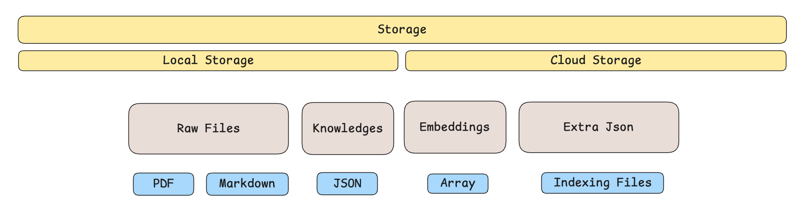

# QuantMind Storage Layer: Design Document



## 1. Introduction & Motivation (The "Why")

The QuantMind framework is designed to process vast amounts of unstructured financial content into a structured, queryable knowledge base. The **Storage Layer** is the heart of this system, serving as the persistent, reliable, and efficient foundation for this knowledge base.

Its primary motivations are:

- **Centralized Data Management**: To provide a single source of truth for all processed data, including original source files, structured knowledge, vector embeddings, and operational metadata.
- **Decoupling & Modularity**: To separate the logic of data persistence from the components that produce or consume it (e.g., `Parsers`, `Taggers`, `Retrievers`). This allows other components to operate without worrying about the underlying storage mechanism (e.g., file system, database).
- **Efficiency & Performance**: The knowledge base can grow to millions of items. An efficient storage and retrieval mechanism is critical for the system's overall performance, especially for lookup-intensive operations.
- **Data Integrity & Resilience**: To ensure that data is stored correctly and consistently, and to provide mechanisms for recovery and maintenance in case of inconsistencies.
- **Extensibility**: To design a system that can easily be extended to support different storage backends (e.g., local files, cloud storage, a vector database) without requiring changes to the core application logic.

## 2. Architecture & Core Concepts (The "How")

The storage layer is built on a set of core principles: an abstract interface, a concrete file-based implementation, and a high-performance indexing system.

### 2.1. `BaseStorage`: The Abstract Contract

The architecture starts with `quantmind.storage.base.BaseStorage`, an abstract base class (ABC) that defines the universal interface for any storage implementation. This ensures that any new storage backend will be a drop-in replacement.

The contract manages four distinct types of data:

- **Raw Files**: The original, unprocessed source files (e.g., PDFs from ArXiv, raw HTML).
- **Knowledges**: Structured `KnowledgeItem` objects (including specialized types like `Paper`), typically stored as JSON. These represent the processed, value-added data.
- **Embeddings**: Vector representations of the knowledge items, used for semantic search and retrieval.
- **Extra**: Auxiliary data, primarily used for storing indexes and other metadata that supports the storage layer's operations.

### 2.2. Specialized Knowledge Processing

To handle the unique needs of different data types, the `BaseStorage` interface includes a specialized processing method:

```python
def process_knowledge(self, knowledge: KnowledgeItem) -> str:
```

This method acts as a router. While it stores any `KnowledgeItem` by default, it contains special logic for subtypes. For instance, when it receives a `Paper` object:

1. It first stores the `Paper` metadata as a knowledge item.
2. It then checks if the `Paper` has a `pdf_url`.
3. If a URL exists and the corresponding PDF is not already in the raw file storage, it automatically downloads the content and stores it using `store_raw_file`.

This design elegantly handles type-specific logic within the storage layer, simplifying the upstream workflow agents.

### 2.3. `LocalStorage`: A Concrete Filesystem Implementation

`quantmind.storage.local_storage.LocalStorage` is the default, file-based implementation of `BaseStorage`.

#### Directory Structure

It organizes data on the filesystem in a clear, hierarchical structure defined by `LocalStorageConfig`:

```text
<storage_dir>/
├── 📂 raw_files/          # Raw source files (e.g., paper_id.pdf)
├── 📂 knowledges/         # Structured data (e.g., paper_id.json)
├── 📂 embeddings/         # Vector embeddings (e.g., paper_id.json)
└── 📂 extra/              # Indexes and other metadata
    ├── 📄 raw_files_index.json
    ├── 📄 knowledges_index.json
    └── 📄 embeddings_index.json
```

#### High-Performance Indexing System

A key challenge with a simple filesystem approach is the inefficiency of lookups. Iterating through a directory to find a file (`glob`) is an O(n) operation, which becomes unacceptably slow as the dataset grows.

To solve this, `LocalStorage` implements a **high-performance, persistent indexing system**.

**How it Works:**

1. **Index Files**: For each core data type (`raw_files`, `knowledges`, `embeddings`), a corresponding JSON index file is maintained in the `extra/` directory. This index is a simple key-value map:
    - `file_id` -> `{ "path": "relative/path/to/file", "extension": ".pdf" }`

2. **In-Memory Cache**: On initialization, `LocalStorage` loads these JSON files into in-memory dictionaries (`self._raw_files_index`, etc.) for instantaneous O(1) lookups.

3. **Real-time Updates**: Every `store_*` or `delete_*` operation automatically updates both the in-memory index and the corresponding JSON file on disk, ensuring data consistency.

    ```python
    # Example: store_raw_file
    def store_raw_file(...):
        # ... write file to disk ...

        # Update and save the index
        self._raw_files_index[file_id] = {"path": ..., "extension": ...}
        self._save_index("raw_files")
    ```

4. **Efficient Lookups**: `get_*` methods now first consult the in-memory index for a near-instant lookup. The costly filesystem scan is only used as a last-resort fallback.

    ```python
    # Example: get_raw_file
    def get_raw_file(self, file_id: str):
        # 1. Fast O(1) lookup in the index
        if file_id in self._raw_files_index:
            return ...

        # 2. Fallback to O(n) directory scan (if not found in index)
        # ... glob filesystem ...
        # If found, add to index for future fast lookups
    ```

**Resilience and Self-Healing:**

The indexing system is designed to be robust:

- **Automatic Rebuilding**: If an index file is missing or corrupt on startup, `LocalStorage` will automatically scan the corresponding data directory and rebuild the index from scratch.
- **Self-Healing**: If an index entry points to a file that has been deleted from the filesystem externally, the `get_*` method will detect this, remove the stale entry from the index, and save the corrected index.
- **Manual Rebuild**: A public `rebuild_all_indexes()` method is provided for manual maintenance and data recovery.

## 3. Configuration

The storage layer is configured via `quantmind.config.storage.LocalStorageConfig`, a Pydantic model that allows for easy setup, primarily defining the `storage_dir`.

```python
from quantmind.config import LocalStorageConfig

# Default configuration
config = LocalStorageConfig() # Uses ./data

# Custom configuration
config = LocalStorageConfig(storage_dir="/path/to/my/storage")
```

The config model's `model_post_init` hook automatically handles the creation of the storage directory and all its required subdirectories.

## 4. Conclusion

The QuantMind storage layer is a modular, extensible, and high-performance system for managing the project's knowledge base. By combining a clear abstract interface with an efficient, self-healing, file-based implementation, it provides a robust foundation that can scale effectively while remaining easy to manage and extend. The recent addition of the indexing system transforms its lookup performance from a potential bottleneck into a key strength.
